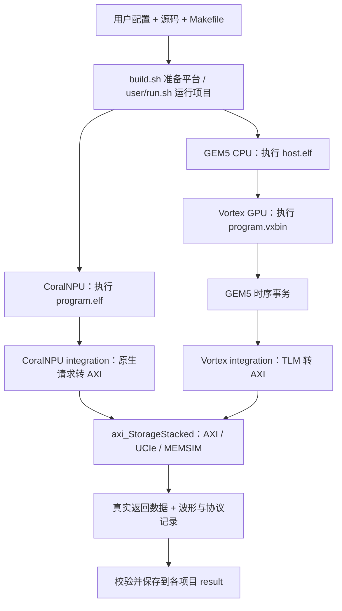

# 项目文件解释版

这里是 [StorageStacked-docs](https://github.com/hy2581/StorageStacked-docs) 文档仓库，包含 47 篇中文说明。
三个项目各自的配置与操作教程保存在各仓库的 `docs/`，下方提供入口。

这里按原工程路径保存中文 Markdown 说明，逐文件解释职责、输入输出、执行顺序和关键参数，并配有 Mermaid 图。
解释文件统一使用 `.md` 后缀，并保留原文件名：例如 `build.sh.md`、`config.json.md`、`Makefile.md`、`host.cpp.md`。
`axi_master.cc.md` 与 `axi_master.hh.md` 分别解释实现文件和头文件，避免同名覆盖。
这些副本可直接按 Markdown 预览，实际执行请使用原工程。

## 下载文档和项目

只阅读时，直接在 GitHub 点击下面的目录即可。需要运行时，在同一个父目录执行：

```bash
git clone https://github.com/hy2581/axi_StorageStacked.git
git clone https://github.com/hy2581/coralnpu_StorageStacked.git
git clone https://github.com/hy2581/vortex_StorageStacked.git
git clone https://github.com/hy2581/StorageStacked-docs.git markdown
```

最后一行把文档仓库放进本地 `markdown/`，与三个项目并排。
下载结束后，按对应项目的 `docs/README.md` 准备环境、构建和运行。
文档里的源码链接固定到 [SOURCE_VERSIONS.json](SOURCE_VERSIONS.json) 记录的提交，
便于日后代码变化时仍能查看讲解所对应的版本；克隆命令默认下载各仓库最新的主分支。

## 按指定路径阅读

| 路径 | 入口 | 内容 |
| --- | --- | --- |
| coralnpu_StorageStacked/user | [用户目录](coralnpu_StorageStacked/user/README.md) | SMOKE、LLM、配置、Makefile、运行入口与结果文件 |
| coralnpu_StorageStacked/integration | [桥接目录](coralnpu_StorageStacked/integration/README.md) | NPU 原生请求如何转成 AXI |
| coralnpu_StorageStacked/build.sh | [构建脚本](coralnpu_StorageStacked/build.sh.md) | 平台准备、路径设置、编译与日志 |
| vortex_StorageStacked/integration | [桥接目录](vortex_StorageStacked/integration/README.md) | GEM5 TLM 请求如何转成 AXI |
| vortex_StorageStacked/user | [用户目录](vortex_StorageStacked/user/README.md) | CPU host.cpp、GPU kernel.cpp、配置与输出 |
| vortex_StorageStacked/build.sh | [构建脚本](vortex_StorageStacked/build.sh.md) | GEM5/Vortex/存储平台与用户程序的构建 |

## 整体关系



## 范围和读法

- 36 个原有源码、配置和脚本都有对应解释版，目录结构保持一致，文件名统一追加 `.md`，包括 `user/.gitignore.md`。
- user/项目/result 中的自动生成文件按类型汇总在 smoke/result/README.md 和 llm/result/README.md，避免重复复制历史大体积输出。
- 配置表中的“当前值”来自本次读取的源码；类声明初始值与用户运行配置分别说明。
- 每个解释版开头都提供对应源码提交的 GitHub 链接。源码决定实际行为，说明用于帮助阅读。
- 这些页面提供阅读说明；本轮同时完善三个原项目的 docs，未改动运行实现，也未重新运行设备仿真。输出说明不代表一次新的测试结果。

## 第一次阅读，从这里开始

[先把项目跑懂](00-先把项目跑懂.md) 用 41→42 讲解目录、命令、JSON、指针、访存等待和五通道。
后面的逐文件说明在原有职责表之外，补充了具体算例、修改后果、排错位置和上下游关系。

| 想先解决的问题 | 阅读位置 |
|---|---|
| AXI 的 --input 到底填什么 | [AXI 输入入门](https://github.com/hy2581/axi_StorageStacked/blob/0f416be965c0efaa431530aa132cbbd4d0d88eec/docs/01-%E7%8E%AF%E5%A2%83%E9%85%8D%E7%BD%AE%E4%B8%8E%E7%8B%AC%E7%AB%8B%E8%B4%9F%E8%BD%BD%E5%85%A5%E9%97%A8.md) |
| NPU 配置、USER 任务怎么运行 | [CoralNPU 配置实验](https://github.com/hy2581/coralnpu_StorageStacked/blob/02d3644d126d96d0da52f368ff75ec61d62b4f57/docs/05-%E9%85%8D%E7%BD%AE%E5%AE%9E%E9%AA%8C%E4%B8%8EUSER%E8%B4%9F%E8%BD%BD%E8%AF%A6%E8%A7%A3.md) |
| CPU/GPU 配置与 USER 任务怎么配合 | [Vortex 配置实验](https://github.com/hy2581/vortex_StorageStacked/blob/2014e742e88dcd2d8209c4ddb86c0d6c2d0ce5c2/docs/06-%E9%85%8D%E7%BD%AE%E5%AE%9E%E9%AA%8C%E4%B8%8EUSER%E8%B4%9F%E8%BD%BD%E8%AF%A6%E8%A7%A3.md) |
| 没学过这些代码写法，先认识概念 | [基础读法](00-先把项目跑懂.md) |
| 想知道文档检查覆盖了什么 | [本轮核对记录](文档核对记录.md) |

阅读文件时，原文件链接用于定位本次讲解对应的实现；代码片段只摘取理解当前问题所需的几行。
文中的“默认结果”“应当”是输入与实现对应的预期，不代表本轮重新执行了设备仿真。
