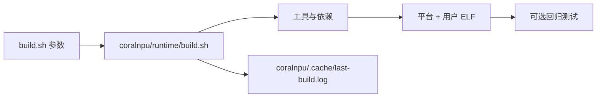

# build.sh：解释版

对应原文件：[coralnpu_StorageStacked/build.sh](https://github.com/hy2581/coralnpu_StorageStacked/blob/02d3644d126d96d0da52f368ff75ec61d62b4f57/build.sh)。本文件以原文件名加 `.md` 命名，内容为 Markdown 阅读说明。

仓库级构建入口：配置依赖路径，准备平台，并编译用户示例。

## 输入与输出

输入是构建选项和 `coralnpu/runtime/paths.json` 中的工具、依赖配置。
用户常用选项为 `--storage`、`--jobs`、`--test`；参数由内部构建脚本解析。
`--storage` 使用相对于仓库根目录的路径，`--jobs` 支持 1..128。

输出包括 CoralNPU 运行库、存储平台、`coralnpu_sim` 和两个示例的 `program.elf`。
平台缓存放在 `coralnpu/.cache/`，示例构建产物放在各自的 `user/项目/result/build/`。

## 脚本逐段做什么

| 代码段 | 含义 |
| --- | --- |
| `set -euo pipefail` | 命令失败、未定义变量或管道失败时停止构建。 |
| `cd ... BASH_SOURCE[0]` | 以脚本所在的仓库根目录为工作目录，避免依赖调用者所在目录。 |
| `--help / -h` 分支 | 直接将帮助请求交给 coralnpu/runtime/build.sh。 |
| `mkdir -p coralnpu/.cache` | 确保构建缓存与日志目录存在。 |
| 内部构建调用 | 转发全部参数，把标准输出和错误输出保存到 last-build.log。 |
| 成功分支 | 打印完整构建日志末尾 2 行。 |
| 失败分支 | 打印日志末尾 25 行和日志位置，返回退出码 1。 |

## 内部构建负责什么

检查公共 AXI 项目、保存相对路径设置、准备编译工具、构建平台，再编译 smoke 和 llm。
路径变更时会处理相关可重建缓存。加入 `--test` 后继续执行回归；普通构建完成后，用户通过 `user/run.sh` 选择运行项目。

这层入口的职责是整理构建环境和日志。每个用户项目具体编译哪些源码，由其 `src/Makefile` 决定。



## 常用命令

在原仓库根目录执行：

```bash
./build.sh --storage ../axi_StorageStacked --jobs 12
./build.sh --test
cd user
./run.sh smoke
```

## 第一次构建与日常运行怎样分开

`build.sh` 负责准备公共平台，让编译器、设备模型和存储库能一起工作。
`user/run.sh` 负责具体一次任务，包括新建结果目录、运行和验收。
构建完成后看到 ELF，只说明程序文件已经产生，仍需执行任务得到实际输出。

在原项目根目录，可以按以下顺序操作：

```bash
./build.sh --help
./build.sh --storage ../axi_StorageStacked --jobs 4
./user/run.sh smoke
```

`--storage` 从仓库根目录解析；上例指向旁边的公共存储目录。
`--jobs 4` 限制现实机器上的并行编译任务数。它不改变模拟处理器核数。

## 哪些改动要回到这里

| 改动 | 推荐操作 |
|---|---|
| 用户输入或用户 C++ 程序 | 重新运行对应 user 项目 |
| integration、设备源码、公共 AXI/内存源码 | 执行根目录构建，再运行相关检查 |
| 仓库移动位置、依赖路径改变 | 重新保存相对路径并构建 |
| 想做完整平台回归 | `./build.sh --test` |

配置切换与源码编辑有区别：自动平台检查识别配置，不保证识别所有源码变动。
修改平台实现后不要只靠旧缓存运行。

## 构建失败先查什么

本外层脚本把内部构建输出写入 `coralnpu/.cache/last-build.log`。
终端末尾几行只是摘要；查编译失败应打开完整日志，从最早的实际错误看起。
`--help` 直接转交内部入口，不会启动整套编译。

工具还没准备齐时，离线开关不能凭空补齐依赖。
首次准备环境与日常重跑的工作量不同；应按报错定位缺少的工具或文件。
