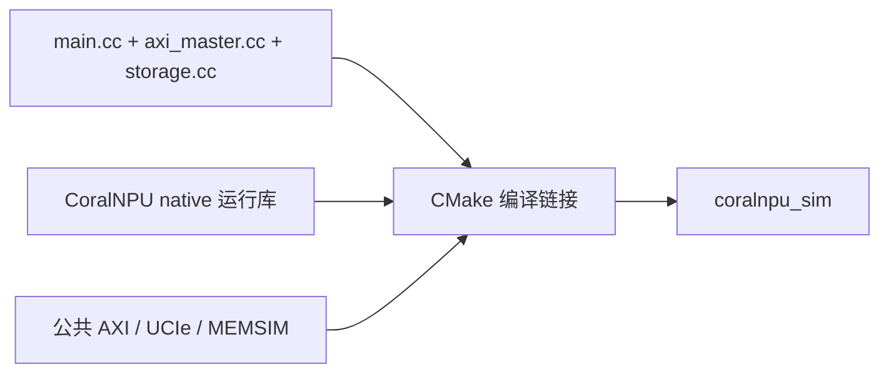

# CMakeLists.txt：解释版

对应原文件：[coralnpu_StorageStacked/integration/CMakeLists.txt](https://github.com/hy2581/coralnpu_StorageStacked/blob/02d3644d126d96d0da52f368ff75ec61d62b4f57/integration/CMakeLists.txt)。本文件以原文件名加 `.md` 命名，内容为 Markdown 阅读说明。

定义独立 SystemC 仿真器 coralnpu_sim 的编译与链接方式。

## 输入与输出

输入是本目录的 C++ 桥接代码、CoralNPU 原生运行库、公共 AXI 存储工程，以及上层构建器传入的依赖路径和链路参数。
输出是 `coralnpu_sim`；用户的 `program.elf` 由用户项目 Makefile 另行编译。

## 按文件顺序解释

| 配置或命令 | 作用 |
| --- | --- |
| `cmake_minimum_required / project` | 要求 CMake 3.20 及以上，启用 C、C++、汇编。 |
| `CMAKE_CXX_STANDARD 17` | 以 C++17 编译桥接代码。 |
| `add_compile_options(-UNDEBUG)` | 保留断言检查，运行时协议约束仍然有效。 |
| `PROJECT_ROOT / STORAGE_ROOT` | 根据本目录和传入的 STORAGE_PATH 定位两个工程；内部可解析为完整路径，用户配置仍用相对路径。 |
| `AOU_LINK_*` 编译定义 | 将 lane 数、速率、每符号位数、周转时延传入链路代码。 |
| `STORAGE_BUILD_CLI OFF` | 将公共存储作为库使用，本次不构建其独立命令行程序。 |
| `STORAGE_MEMSIM_LIBRARY` | 指定已经准备好的 libstoragestacked_memsim.so。 |
| `add_subdirectory` | 纳入公共 AXI 工程的构建目标。 |
| `add_executable` | 以 main.cc、axi_master.cc、storage.cc 构建 coralnpu_sim。 |
| `target_include_directories` | 加入当前目录与 CoralNPU native 头文件目录。 |
| `target_link_libraries` | 链接 StorageStacked::axi 与 libcoralnpu-native.so。 |

## 构建“运行器”和编译“用户程序”有什么区别

`coralnpu_sim` 在现实 Linux 主机上运行，里面包含设备模型、信号桥和存储模型。
`program.elf` 是给模型中的 NPU 执行的程序。它们面向不同执行位置，不能互换。

`add_executable` 声明要生成一个可执行程序；`target_link_libraries` 告诉链接器
它还需要设备库和公共存储库；`add_subdirectory` 将公共工程的构建目标纳入当前构建。
这里直接引用同级源码，不会在 integration 中另放一份内存实现。

## 为什么 UCIe 参数也进入编译

`LINK_LANES` 等值会变为 `AOU_LINK_*` 编译定义。
C++ 看到的是编译时常量，因此改 JSON 后必须使用与之匹配的运行器。
平台构建器负责这件事，main.cc 还会比较实际编译值与运行配置，防止误用旧运行器。

公共 CLI 被关闭，是因为当前程序已有自己的 main 和设备请求来源。
本目录设置 C++17；公共 mem_sim 的构建另有更高语言标准要求，环境按整体依赖准备。

修改本文件后用根目录构建入口，避免遗漏 native 库和预先构建的内存库。
只想换负载输入则改 user 中的 JSON，不需要修改这里的链接清单。
