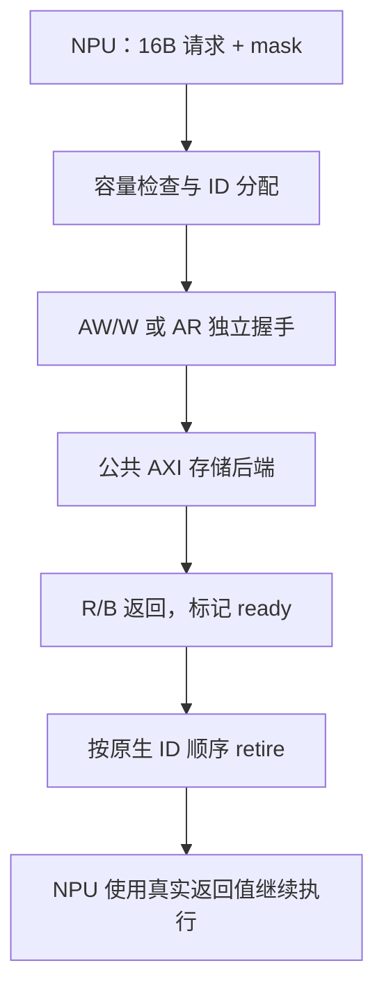

# axi_master.cc：NPU 的读写请求怎样变成 AXI 信号

对应原文件：[coralnpu_StorageStacked/integration/axi_master.cc](https://github.com/hy2581/coralnpu_StorageStacked/blob/02d3644d126d96d0da52f368ff75ec61d62b4f57/integration/axi_master.cc)。

把 NPU 的 16 字节原生访存请求驱动为 AXI 握手，并将实际返回值交回 NPU。

## 启动时和每个时钟周期做什么

构造函数创建原生 CoralNPU 实例，注册请求回调 submit 和容量查询回调，随后加载用户 ELF。
两个 SystemC 过程分别由 AXI 时钟和 NPU 时钟驱动：tick 处理总线，nativeTick 推进设备。
NPU 停止时必须没有未完成外部访问，否则报告错误。

## 一次请求经过哪些步骤

| 函数或阶段 | 实际动作 |
| --- | --- |
| `submit` | 检查在途容量和 16 字节地址对齐，分配 1..1023 的空闲 AXI ID，保存数据/掩码和原生 ID。 |
| 加入队列 | 写请求同时加入 AW/W 队列，读请求加入 AR 队列；记录同方向、同原生 ID 的顺序。 |
| `drive` | 设置地址、ID、LEN=0、SIZE=4、INCR burst，驱动一个 16 字节有效传输。 |
| `tick` | 在 VALID 与 READY 同时成立时推进队列；R 返回提取 16 字节，B 返回保存写响应码。 |
| `retire` | 只返回 order 队头且 ready 的请求，调用 coralnpu_complete，随后释放在途槽。 |
| `nativeTick` | 先回送就绪请求，再调用 coralnpu_step；结束时记录完成 tick、cycles 和 mailbox。 |

## 16 字节怎样放进 256 位 AXI

AXI 数据总线为 256 位，即 32 字节。原生请求是 16 字节对齐的 16 字节块，因此 lane=`address % 32` 为 0 或 16。
写数据放入相应的半个总线宽度，WSTRB 由 16 位原生 mask 左移 lane 得到。
读返回从相同位置抽取 16 字节。LEN=0 表示一拍，SIZE=4 表示每拍 2^4=16 字节；WLAST 为真。

## 存储忙时怎样等待

stalls 打开时，按 ID 奇偶让 AW 或 W 延迟 3 周期，形成写地址领先或写数据领先两种情况。
RREADY 按 cycle%7>=3，BREADY 按 cycle%5>=2 开关，产生确定性返回背压。
槽位达到 outstanding 时原生容量回调拒绝继续送入请求，并记录 capacityDenials。

## 会保存哪些记录

npu_requests.csv 保存 request/response、原生序号、原生 ID、AXI ID、数据、mask 和响应码。
`transactions.csv` 记录每笔请求从收到到交回 NPU 的过程；这类请求通常是 16 字节、1 个 AXI 段。
AXI 返回就绪时刻与最终交回 NPU 的时刻可能不同，因为还需要等待原生 ID 顺序和 NPU 时钟。



## 从地址算出数据落在哪些字节

假设原生请求从 `0x90000010` 写 16 字节，原生 mask 为 `0x000f`：

```text
AXI 总线宽度 = 32 字节
lane = 0x90000010 % 32 = 16
原生第 0～3 字节 → 总线第 16～19 字节
WSTRB = 0x000f << 16 = 0x000f0000
AWLEN = 0，表示一拍
AWSIZE = 4，表示 2^4=16 字节
```

数据块有 16 字节，但只有 mask 为 1 的四字节允许改变内存。
收到读返回时，桥从同一组 lane 提取 16 字节，再交给设备。
掩码位置和数据位置必须一起移动，否则可能数值正确但写错地址。

## 两个时钟函数各做什么

`tick` 在 AXI 时钟边沿观察握手；只有 VALID 和 READY 同时为 1 才推进队列。
R/B 收到后，设置 ready 和 axiDone。
`nativeTick` 在设备时钟边沿先 retire 已就绪的返回，再推进设备。
这让设备在拿到真实数据之后才继续相应的执行。

容量已满时回调返回“暂不能接收”，上游要等待。
`capacityDenials` 记录容量受限的观测，不等于数据错误或丢失请求数。

## 怎样在两份 CSV 中找同一笔请求

`npu_requests.csv` 用 sequence 标识原生请求，wire_id 给出本次 AXI ID。
`transactions.csv` 用 substream 保留原生 sequence，id 是 AXI ID。
先用 sequence 关联上游收发，再用 ID 与时间区间对应 AXI 事件。
ID 可以复用，因此长期日志不能只按一个 ID 全局合并。
