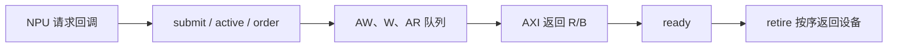

# axi_master.hh：转换请求时要保存哪些信息

对应原文件：[coralnpu_StorageStacked/integration/axi_master.hh](https://github.com/hy2581/coralnpu_StorageStacked/blob/02d3644d126d96d0da52f368ff75ec61d62b4f57/integration/axi_master.hh)。

这个头文件声明了请求转换器：它接收 NPU 的读写请求，记录状态，随后发送 AXI 信号。

## 其他文件怎样调用它

输入为 ConfigParams、AXI 时钟/复位，以及 CoralNPU 原生运行库回调的访存请求。
输出是 MasterPorts 的五个 AXI 通道；AXI 返回数据完成后，再回送 CoralNPU。
idle、done、cycles、mailbox、doneTick 供顶层决定仿真何时结束。

## Txn 保存一笔什么请求

| 字段组 | 含义 |
| --- | --- |
| `seq / nativeId` | 设备原生请求的序号与 ID |
| `id` | 适配器分配的 AXI wire ID |
| `address / mask / data` | 16 字节对齐的地址、16 位字节有效掩码、16 字节数据 |
| `write / response / ready` | 读写方向、响应码、AXI 返回是否已就绪 |
| `begin / accept / axiDone` | 请求建立、接受、AXI 完成时间 |
| `awAfter / wAfter` | 允许发出写地址和写数据的最早周期，用于通道独立性测试 |

## 队列和函数如何配合

active 按 AXI ID 保存在途请求。order 按“读写方向 + nativeId”记录顺序，保证同类原生 ID 的完成顺序。
awq、wq、arq 分别负责写地址、写数据和读地址，允许不同通道独立推进。
nativeClock 驱动 NPU，clk 驱动 AXI，两者有各自周期。

submit 接收设备请求；tick 处理 AXI 握手；drive 给出下一周期信号；
retire 把已就绪的响应按序交回设备；nativeTick 推进一步 NPU；sourceRow 写原生请求日志。
实现细节见 [axi_master.cc.md](axi_master.cc.md)。

## 为什么一笔请求需要保存这么多状态

请求发出后可能要等待很多周期，函数早已返回，数据却还没有回来。
Txn 把请求的地址、ID、进度和时间留在内存里，让后续时钟事件继续处理同一件事。

`std::map` 可以按 ID 找到请求；`std::deque` 保存待处理编号的先后顺序。
AW、W、AR 有不同队列，因为“地址已传走”与“数据已传走”可以发生在不同周期。
W 按队列顺序发送，不因为它没有 WID 就能随意改变写数据次序。

例如 nativeId 相同的两笔读，分别分配 AXI ID 7 和 8。
即使 ID 8 先收到 R，order 仍会让它等 ID 7 先交回，再完成 ID 8。
读写方向也参与 order 的键，同编号的不同方向分别保序。

## 先辨认状态，再读函数

| 状态 | 含义 |
|---|---|
| 等待接纳 | 上游想发送，桥可能还没有容量 |
| 在途 active | 桥已经接收，等待地址、数据或返回完成 |
| AXI 返回就绪 | 存储侧数据或写响应已经到了 |
| 上游完成 | 响应已经交回，才能释放相应资源 |

`ready=true` 只表示这笔 AXI 返回已收齐。
`retire` 还要检查它是不是对应 order 的队头，再调用 `coralnpu_complete` 并释放 active 记录。
