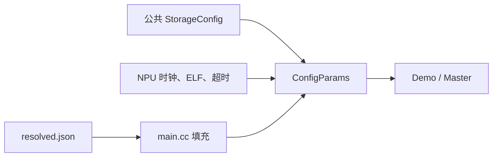

# config.hh：解释版

对应原文件：[coralnpu_StorageStacked/integration/config.hh](https://github.com/hy2581/coralnpu_StorageStacked/blob/02d3644d126d96d0da52f368ff75ec61d62b4f57/integration/config.hh)。本文件以原文件名加 `.md` 命名，内容为 Markdown 阅读说明。

定义 CoralNPU 桥接使用的统一 C++ 配置结构 ConfigParams。

## 结构关系

`ConfigParams` 继承公共项目的 `StorageConfig`，因此同时具有存储地址窗口、链路资源和 MEMSIM 参数。
本文件只新增 NPU 驱动所需的时钟、超时、在途容量和 ELF 路径。
main.cc 读取本次 resolved.json 后填入这些字段，再传给 Demo 与 Master。

## 本文件新增字段

| 字段 | 初始值 | 用途 |
| --- | --- | --- |
| `period` | 2000000 fs | AXI 时钟周期，2 ns |
| `device_period` | 2000000 fs | NPU 时钟周期，默认对应 500 MHz |
| `max_ticks` | 20000000000000 fs | 最大仿真时间 |
| `outstanding` | 16 | 桥接器最大在途请求数 |
| `stalls` | true | 启用确定性等待与背压 |
| `kernel` | 空字符串 | 本次用户 program.elf 的路径 |

## 从 StorageConfig 继承的主要字段

| 字段 | 公共结构初始值 | 含义 |
| --- | --- | --- |
| `base / size` | `0x90000000 / 0x30000000` | 外部存储窗口覆盖 0x90000000..0xbfffffff |
| `planes / replay` | `2 / false` | AoU 资源 plane 与错误重传开关 |
| `memsim_slots / memsim_channels` | `8 / 2` | 后端在途 burst 数与存储通道数 |
| `memsim_scale / memsim_queue` | `1 / 4` | 存储时钟倍率与队列容量 |
| `memsim_response_hold` | `0` | 额外延迟响应的存储 tick 数 |
| `memory_backend / memsim_standard` | `memsim / hbm4` | 后端类型与存储协议模型 |
| `trace_dir` | 空字符串 | 运行日志、CSV 和波形输出目录 |

## 修改入口

上表是结构的初始化值；main.cc 会用实际运行配置覆盖相关字段。
日常调整优先修改 user/项目/config.json，具体生效值以结果目录的配置记录为准。
NPU 时钟和 AXI 时钟是独立字段，不必保持相同频率。



## 用默认频率换算字段

JSON 中 `npu.clock_mhz=500`，main.cc 转成：

```text
device_period = 1000000000 / 500 = 2000000 fs = 2 ns
axi.period_ns = 2
period = 2 × 1000000 = 2000000 fs
```

两者默认相同，但代表不同的时钟。把 NPU 改为 1000 MHz，会使设备周期变为 1 ns，
AXI 仍可保持 2 ns。不能只看到两个 period 字段就认为重复。

`max_ticks` 是绝对仿真时间上限，`outstanding` 是请求个数，`kernel` 是路径字符串；
不同量不能混用或省略单位。

## 结构继承怎样理解

`ConfigParams : StorageConfig` 表示在公共存储配置上再增加设备接入需要的字段。
因此访问 `p.memsim_channels` 时，它虽未在本文件逐项声明，仍来自父结构。
日常改 JSON 后，由 main.cc 覆盖这些字段；头文件初始化值不一定就是本次运行的最终值。
