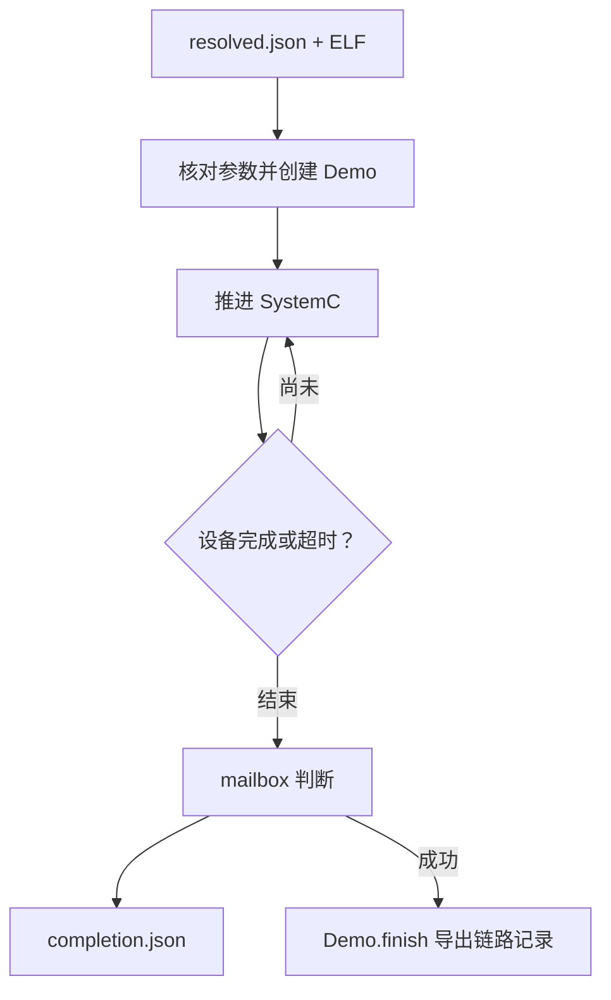

# main.cc：仿真从哪里启动

对应原文件：[coralnpu_StorageStacked/integration/main.cc](https://github.com/hy2581/coralnpu_StorageStacked/blob/02d3644d126d96d0da52f368ff75ec61d62b4f57/integration/main.cc)。

仿真从这里开始：读取配置、启动 SystemC，结束后写下设备为什么停止。

## 调用接口

正常运行参数为 `coralnpu_sim resolved.json output-directory`。
user/run.sh 在结果目录中执行它，因此输出目录通常传 `.`。
`--check` 只打印可用运行模式，不加载 ELF，也不等于通过一次计算测试。

## sc_main 的工作顺序

| 步骤 | 动作与目的 |
| --- | --- |
| 设置时间单位 | 使用 1 fs 时间分辨率。 |
| 读取 JSON | 读取 architecture 和 kernel 路径，填充 ConfigParams。 |
| 转换时钟 | AXI 周期 ns × 1000000 得到 fs；NPU 周期为 1000000000 / clock_mhz fs。 |
| 核对 UCIe | 运行配置的四项 UCIe 参数必须与当前平台编译值一致，否则抛出错误。 |
| 写出实际配置 | ucie_config.json 保存编译链路值；config.json 保存程序实际使用的时钟、地址窗口等。 |
| 创建 Demo | 构建 NPU AXI master、公共存储、时钟复位和监视器。 |
| 推进仿真 | 每次最多推进 100000000 fs，即 100 ns，直到设备完成或达到 max_ticks。 |
| 判断完成 | 要求设备 done 且 mailbox 为 0x600d0000。 |
| 保存并退出 | 写 completion.json，成功时调用 Demo.finish 导出链路结果，按成功/失败返回 0/1。 |

## 输出怎样理解

`completion.json` 记录 passed、code、cause、tick_fs、cycles 和 mailbox。
设备超时或异常时返回失败，异常详情写入运行日志。
这里的 passed 只表示设备计算正常结束；run.sh 之后还要调用独立数据与链路校验，才能形成最终 summary.json。

## 从 resolved 到实际模型逐项追踪

用户 JSON 的 `memsim.scale` 先被运行入口整理成
`resolved.json` 中的 `architecture.memory.scale`，
再由本文件写入 `p.memsim_scale`，最后交给公共后端。
类似地，`npu.clock_mhz` 会整理为 `architecture.device_clock_mhz`，再换算为 fs 周期。

如果 input 中是新值，而结果中的实际参数仍是旧值，
应沿着这几个名称检查传递过程，而不是先修改设备程序。

## 运行循环为什么分小步

主循环每次最多推进 100 ns，随后检查设备是否 done、是否到达时间上限。
“每次推进 100 ns”是外层检查步长，不是设备时钟；
默认 NPU 时钟是 2 ns，SystemC 在这段推进中仍会处理各个时钟事件。

正常完成时 completion 的 tick_fs 使用设备记录的 doneTick。
达到 watchdog 上限却未完成时记录超时；修改超时值前先确认有没有不再返回的请求。

## 怎样判断运行成功

1. 文件和参数能加载；
2. 设备 done，且 mailbox 为 `0x600d0000`；
3. 外层入口继续核对实际计算与完整存储链路。

本文件主要负责前两层和记录收尾；最终 summary 来自后面的完整校验。
