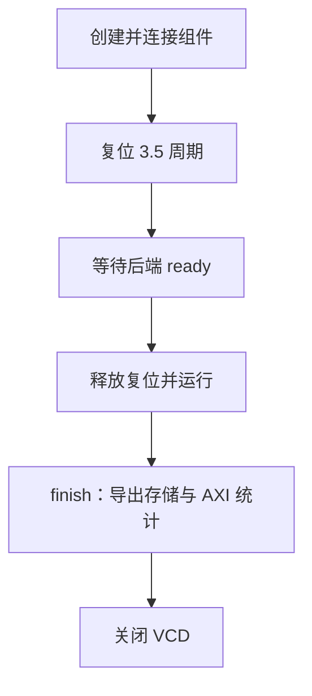

# storage.cc：解释版

对应原文件：[coralnpu_StorageStacked/integration/storage.cc](https://github.com/hy2581/coralnpu_StorageStacked/blob/02d3644d126d96d0da52f368ff75ec61d62b4f57/integration/storage.cc)。本文件以原文件名加 `.md` 命名，内容为 Markdown 阅读说明。

实现 Demo 的连线、复位、波形记录和仿真结束导出。

## 构造函数做什么

创建 AXI 时钟、Master、AouBackend 和 AxiMonitor；把三者接到同一组 wires 和同一时钟/复位。
创建 axi_wave.vcd，时间单位 1 fs，记录 ACLK、ARESETn、AXI 信号和后端信号。
最后注册 reset 线程。

## 各函数的输入与输出

| 函数 | 行为 |
| --- | --- |
| `Demo::reset` | 先保持复位 3.5 个 AXI 周期，再等待公共后端 ready，最后释放复位。 |
| `Demo::finish` | 只执行一次；导出后端数据，把 Master 的接受数、完成数、最大在途数、容量拒绝数与 idle 状态交给 monitor，再关闭 VCD。 |
| `Demo::~Demo` | 若波形文件还未关闭，析构时关闭它。 |

## 为什么需要 finish

SystemC 停止推进后，监视器与后端仍需要整理在途状态和输出记录。
finish 把这些信息统一写出，使 transactions.csv、AXI 握手、flit、存储返回和波形能够相互核对。
finished 标志避免重复导出或重复关闭波形。

## 用默认时钟算一次复位

默认 AXI 周期为 2 ns。`3×周期 + 半周期` 等于 7 ns。
模块至少保持这段复位时间，之后还检查公共存储链路是否 ready。
若链路训练尚未完成，继续按周期等待，而不是到 7 ns 就强行开始发请求。

`bind(wires)` 把两端的对应端口接到同一组信号。
主端写入 awvalid，存储侧就从绑定的同一信号读取它；awready 的方向相反。
这不是先复制一份 trace 再由另一端重放。

## 运行完成后的收尾顺序有什么意义

收尾时先整理已完成访问和各层记录，再关闭波形。
`accepted` 表示正式接纳多少请求，`completed` 表示交回多少响应，
`maxActive` 是运行中观察到的最大在途数，`idle` 表示是否已排空。

这些统计与 JSON 中的容量上限是两类信息：容量是“允许多少”，统计是“实际发生多少”。
NPU 和 AXI 可以使用不同周期。reset 线程负责共同的启动条件，
具体设备步进和 AXI 握手分别由 Master 的 nativeTick 与 tick 处理。
