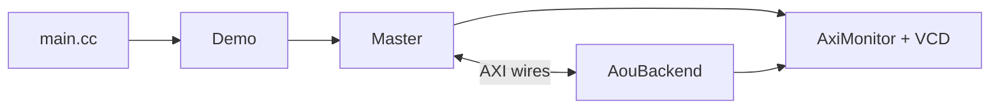

# storage.hh：解释版

对应原文件：[coralnpu_StorageStacked/integration/storage.hh](https://github.com/hy2581/coralnpu_StorageStacked/blob/02d3644d126d96d0da52f368ff75ec61d62b4f57/integration/storage.hh)。本文件以原文件名加 `.md` 命名，内容为 Markdown 阅读说明。

声明 Demo：将 CoralNPU AXI master 与公共存储连接起来的 SystemC 顶层模块。

## 成员分别负责什么

| 成员 | 职责 |
| --- | --- |
| `Signals wires` | 一套共享 AXI 信号，连接发起端、接收端和监视器 |
| `clock / resetn` | 驱动 AXI 时序并控制复位 |
| `Master master` | 把 CoralNPU 原生请求转换为 AXI |
| `AouBackend storage` | 公共工程提供的 AXI/UCIe/MEMSIM 后端 |
| `AxiMonitor monitor` | 观察 AXI 握手并记录统计 |
| `wave / directory / finished` | 保存波形句柄、输出位置及是否已收尾 |

## 外部接口

构造函数输入 ConfigParams；done、cycles、mailbox、doneTick 向 main.cc 提供设备状态，内部直接读取 Master。
finish 负责结束时导出与关闭记录；reset 是内部复位线程。具体实现见 [storage.cc.md](storage.cc.md)。
该类完成组件装配，存储控制器细节由公共后端处理。

## 从“对象里有什么”理解这个头文件

头文件先列出成员，实际初始化次序和行为在 [storage.cc](storage.cc.md)。
`public` 下的方法允许外部调用；`private` 下的成员由这个模块自己管理。
构造函数创建组件，析构函数在对象销毁时处理资源。

| 成员类别 | 可以怎样想象 |
|---|---|
| clock、resetn | 告诉各部件什么时候行动、什么时候仍在初始化 |
| wires | 两端共享的信号线 |
| Master | 翻译并发送上游读写请求 |
| 公共后端 | 收到 AXI 请求后处理链路与在线内存 |
| monitor、波形句柄 | 旁观者，把发生过的事情记录下来 |
| finished | 记住是否已经收尾，避免重复关闭或重复导出 |

`finish` 用来写出最后状态；不能在请求还没完成时把它当成取消请求的快捷方式。
main.cc 通过 done/cycles/mailbox/doneTick 查询 Master 的设备状态。
这些查询没有替设备推进一个周期；推进由 SystemC 调度过程完成。
