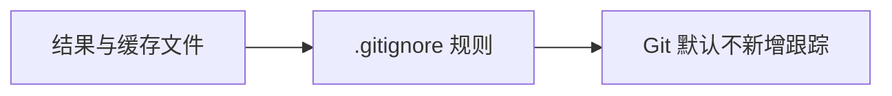

# .gitignore：哪些运行文件不会交给 Git 管理

对应原文件：[coralnpu_StorageStacked/user/.gitignore](https://github.com/hy2581/coralnpu_StorageStacked/blob/02d3644d126d96d0da52f368ff75ec61d62b4f57/user/.gitignore)。

告诉 Git 哪些用户侧运行生成的文件不需要纳入版本管理。

## 两条规则

| 规则 | 作用 |
| --- | --- |
| `*/result/` | 忽略 user/ 下各项目的 result/ 目录，包括编译出的文件、日志和波形。 |
| `__pycache__/` | 忽略 Python 自动生成的字节码缓存目录。 |

## 这些规则不会影响什么

这些规则只影响 Git 对未跟踪文件的处理；不会删除结果，也不会改变编译或仿真。已经被 Git 跟踪的文件不会仅因新增忽略规则而自动取消跟踪。

## 看两个文件会不会被 Git 跟踪

新增 `user/my_task/config.json` 后，它通常会显示为待纳入版本管理的文件；
运行生成的 `user/my_task/result/first/axi_wave.vcd` 则被 `*/result/` 匹配。

因此“Git 状态里看不到结果”不等于“结果没生成”。先在磁盘上打开对应结果目录。
反过来，忽略规则也不会自动清理大波形；结果是否保留由用户自己决定。

这份规则放在 user 下，作用于其下目录。`*/result/` 中的星号对应任务目录名，
所以新建 my_task 也能沿用规则，不必每添加一个任务就再加一行。
