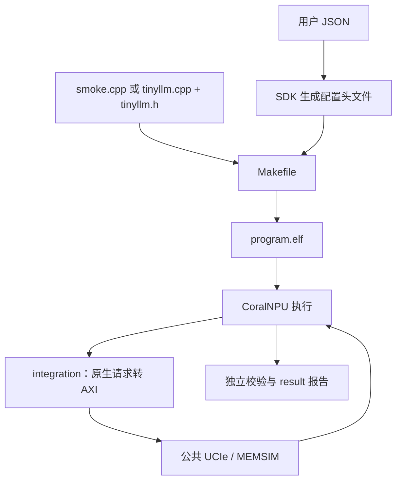

# coralnpu_StorageStacked/user：阅读导航

用户在这里选择负载与参数，编写源码，运行项目并查看结果。
本目录使用“原文件名 + .md”命名；这些副本的内容是 Markdown 解释，运行操作请回到原工程。
先看 config.json，再看 Makefile 和计算源码，最后看 run.sh 如何把各阶段串起来。

## 逐文件入口

| 文件 | 用途 |
| --- | --- |
| [run.sh.md](run.sh.md) | 选择项目，完成编译、运行、校验和结果归档 |
| [.gitignore.md](.gitignore.md) | 忽略生成结果和 Python 缓存 |
| [smoke/config.json.md](smoke/config.json.md) | 该负载的全部用户配置 |
| [smoke/src/Makefile.md](smoke/src/Makefile.md) | 声明源码和公共编译规则 |
| [smoke/src/smoke.cpp.md](smoke/src/smoke.cpp.md) | NPU 加一程序 |
| [smoke/result/README.md](smoke/result/README.md) | 生成输出按文件类型解释 |
| [llm/config.json.md](llm/config.json.md) | 该负载的全部用户配置 |
| [llm/src/Makefile.md](llm/src/Makefile.md) | 声明源码和公共编译规则 |
| [llm/src/tinyllm.cpp.md](llm/src/tinyllm.cpp.md) | NPU 字符 Transformer |
| [llm/src/tinyllm.h.md](llm/src/tinyllm.h.md) | 模型结构、权重和布局 |
| [llm/result/README.md](llm/result/README.md) | 生成输出按文件类型解释 |

## 整体流程

平台准备见 [build.sh.md](../build.sh.md)，桥接细节见 [integration 导航](../integration/README.md)。

## 从运行结果倒着找源码

第一次可以只读 SMOKE 的几份文件：

1. `config.json.md`：确认输入是 41，配置控制哪些部件。
2. `smoke.cpp.md`：顺着写输入、读输入、加一、写输出、读输出看。
3. `src/Makefile.md`：确认编译的是刚读过的文件。
4. `result/README.md`：确认怎样检查输出 42。
5. `run.sh.md`：把编译、运行、校验串起来。

同名的 smoke、llm 各有独立配置和结果目录。修改 smoke 的 JSON 不会改变 llm 的输入。
根目录构建得到的 `result/build/` 只是预编译产物；一次完整运行会另建结果目录。

## 新任务需要哪些文件

| 文件 | 是否手工维护 | 用途 |
|---|---|---|
| `config.json` | 是 | 输入、平台参数、检查方式 |
| `src/Makefile` | 是 | 列出要编译的源码，接入 SDK |
| `smoke.cpp` 或自定义源码 | 是 | 实现计算和必要的输入输出处理 |
| `project_config.h` | 否 | 构建器根据 JSON 自动生成 |
| `result/某次运行/` | 否 | 每次运行的快照、产物与检查记录 |

具体可复制的实验命令见 [原项目配置实验](https://github.com/hy2581/coralnpu_StorageStacked/blob/02d3644d126d96d0da52f368ff75ec61d62b4f57/docs/05-%E9%85%8D%E7%BD%AE%E5%AE%9E%E9%AA%8C%E4%B8%8EUSER%E8%B4%9F%E8%BD%BD%E8%AF%A6%E8%A7%A3.md)。
