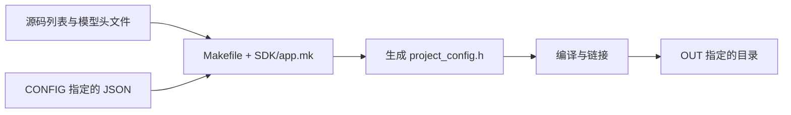

# Makefile：用户程序怎样编译

对应原文件：[coralnpu_StorageStacked/user/llm/src/Makefile](https://github.com/hy2581/coralnpu_StorageStacked/blob/02d3644d126d96d0da52f368ff75ec61d62b4f57/user/llm/src/Makefile)。

这里列出要编译的源文件，再调用 SDK 的规则生成设备程序。

## 每一项的作用

| 变量 | 取值 | 作用 |
| --- | --- | --- |
| `SOURCES` | `tinyllm.cpp` | 要编译的 CoralNPU C++ 程序 |
| `MODEL_HEADER` | `tinyllm.h` | 模型结构、权重与布局元数据，供编译和模型校验读取 |
| `SDK` | `../../../coralnpu/sdk` | 公共编译规则所在目录；路径以当前 src/ 为起点 |

## include 做什么

最后一行 `include $(SDK)/app.mk` 将 SDK 的编译规则纳入当前 Makefile。
这个文件只声明本项目有哪些输入，编译器选择、生成配置头文件和镜像处理由公共规则完成。
新项目沿用这份结构，修改源码文件列表即可复用编译流程。

## 输入与输出

输入：当前 `src/` 的源码、`CONFIG` 指定的 JSON，以及 SDK 的规则。

输出：`program.elf`：CoralNPU 执行的 RISC-V 设备程序。

`CONFIG` 默认取 `../config.json`，`OUT` 默认取 `../result/build`。
`run.sh` 会改为传入本次运行的 `input.json`，并将产物放入本次结果目录的 `build/`。
`project_config.h` 自动生成，不需要在 `src/` 中手工维护。

## 怎样单独构建

在原项目的本目录执行：

```bash
make CONFIG=../config.json OUT=../result/build
```

前提是已在仓库根目录运行过 `build.sh`，平台工具已经准备好。
单独 make 只编译；完整运行与结果检查通过 `user/run.sh` 完成。



## 用目录层数算一次 SDK 路径

当前文件位于 `user/llm/src/`。
三个 `..` 依次回到 llm、user、仓库根目录，再进入 SDK。
所以复制新任务时，只要仍是 `user/新任务/src/`，这个相对层数不变。

`SOURCES` 列出设备程序源码，SDK 用 CoralNPU 工具链编译，产生 RV32 的 `program.elf`。

Makefile 中 `:=` 表示给变量赋值，`$(变量名)` 取变量的内容。
`include` 是把公共构建规则读进来；真正编译用的参数在 SDK 后端继续生成。

## CONFIG 与 OUT 的一次实际展开

从 src 看，`CONFIG=../result/first/input.json` 指向本次固定输入；
`OUT=../result/first/build` 指向本次产物目录。
运行入口传入这些值，所以不用手工改 Makefile 来切换每次结果目录。

`project_config.h` 来自 JSON，CoralNPU 在内部 `coralnpu/sdk/staging/` 生成它，再编译设备 ELF；它不是用户需维护的源码。
如果源码报缺少 `SMOKE_INPUT`，先核对 program.type 与源码是否一致。
LLM 的 `MODEL_HEADER` 必须指向 src 内的模型头文件；
增加新 .cpp 时，也要把它加入相应的源码变量，不能只把文件放进目录。
