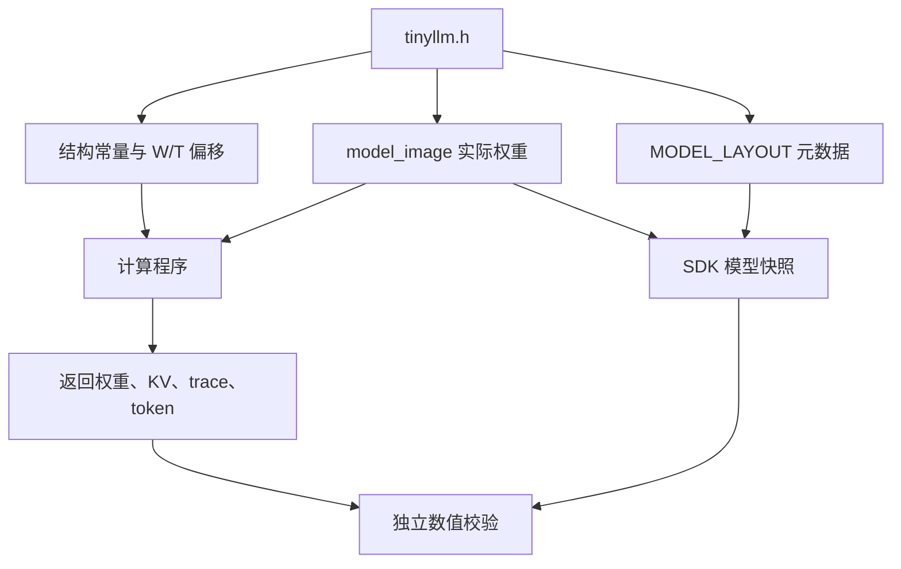

# tinyllm.h：解释版

对应原文件：[coralnpu_StorageStacked/user/llm/src/tinyllm.h](https://github.com/hy2581/coralnpu_StorageStacked/blob/02d3644d126d96d0da52f368ff75ec61d62b4f57/user/llm/src/tinyllm.h)。本文件以原文件名加 `.md` 命名，内容为 Markdown 阅读说明。

将模型结构、权重和可验证的内存布局集中在一个头文件中。

## 本文件保存什么

这是固定的小型字符 Transformer 模型包：一层、两个注意力头、8 维特征、16 维 FFN，词表含 17 个字符。
它同时保存结构常量、张量偏移、FP32 权重数组 `model_image` 和 `MODEL_LAYOUT` 元数据。
prompt 与生成长度由 JSON 决定，经 SDK 写入另外生成的 `project_config.h`。

## 模型常量

| 宏 | 值 | 用途 |
| --- | --- | --- |
| `LLM_DIM` | 8 | 每个 token 的特征维度 |
| `LLM_HEADS` | 2 | 注意力头数，每头 4 维 |
| `LLM_HIDDEN` | 16 | FFN 中间层维度 |
| `LLM_CONTEXT` | 16 | 最大上下文位置数 |
| `LLM_VOCAB` | 17 | 字符词表大小 |
| `LLM_WEIGHT_WORDS` | 1004 | 权重镜像的 FP32 存储字数 |
| `LLM_TRACE_STRIDE` | 148 | 每个位置的中间结果槽位数，单位 float 元素 |

## 权重布局

`W_*` 宏和 `MODEL_LAYOUT.tensors` 描述同一份权重排布。
下表偏移单位为 float 元素，每个元素 4 字节；例如 Q 权重地址为 `0x90000000 + 312 × 4`。

| 张量 | 形状 | 元素偏移 |
| --- | --- | --- |
| `embedding` | 17 × 8 | 0 |
| `position` | 16 × 8 | 136 |
| `norm1_weight` | 8 | 264 |
| `norm1_bias` | 8 | 272 |
| `norm2_weight` | 8 | 280 |
| `norm2_bias` | 8 | 288 |
| `norm_final_weight` | 8 | 296 |
| `norm_final_bias` | 8 | 304 |
| `q` | 8 × 8 | 312 |
| `k` | 8 × 8 | 376 |
| `v` | 8 × 8 | 440 |
| `o` | 8 × 8 | 504 |
| `ff1` | 8 × 16 | 568 |
| `ff1_bias` | 16 | 696 |
| `ff2` | 16 × 8 | 712 |
| `ff2_bias` | 8 | 840 |
| `lm_head` | 8 × 17 | 848 |
| `lm_bias` | 17 | 984 |

## model_image 是什么

`model_image` 保存十六进制形式的 FP32 常量，数组长 1004。
张量实际占用 1001 个参数位置，其余 3 个字属于尾部填充，不能把 1004 当成有效模型参数个数。
构建器读取实际数值并记录模型快照，独立校验器据此核对返回权重和计算结果。

CoralNPU 的 `tinyllm.cpp` 在设备执行时把数组复制到外部 weights 区。

## 中间结果布局

`T_*` 宏指定每个 token 位置中间值的起点。
`trace[pos * LLM_TRACE_STRIDE + T_* + i]` 表示位置 pos、某一阶段的第 i 个元素。
表中的偏移仍以 float 元素计，整个位置跨度为 148。

| 阶段宏 | 位置内偏移 |
| --- | --- |
| `T_EMBEDDING` | 0 |
| `T_NORM1` | 8 |
| `T_Q` | 16 |
| `T_K` | 24 |
| `T_V` | 32 |
| `T_ATTENTION` | 40 |
| `T_ATTENTION_OUTPUT` | 72 |
| `T_RESIDUAL` | 80 |
| `T_NORM2` | 88 |
| `T_FF` | 96 |
| `T_HIDDEN` | 112 |
| `T_NORM_FINAL` | 120 |
| `T_LOGITS` | 128 |

## MODEL_LAYOUT 为什么放在注释中

C++ 编译器把这一段视为注释；SDK 把其中 JSON 当作模型描述读取。
因此它虽然采用注释语法，仍然是构建与验证的有效输入，不能当作普通说明随意删除。
它包含格式、版本、层数、归一化、激活函数、词表，以及每个张量的形状和偏移。

词表按 token 编号从 0 开始排列为 `"\n .abcdehilnortuw"`，其中 `\n` 表示换行字符。



## 权重、偏移、地址，一步步换算

偏移表里的单位是 float 元素，每个元素 4 字节。
例如 `W_Q=312`，Q 矩阵的第一个数位于：

```text
weights 起址 = 0x90000000
Q 的元素偏移 = 312
Q 的字节偏移 = 312×4 = 1248 = 0x4e0
Q 的设备地址 = 0x900004e0
```

8×8 的 Q 矩阵共有 64 个数，占 256 字节。
写地址运算时不要把“312 个元素”直接当成“312 字节”。

`LLM_TRACE_STRIDE=148` 表示每个位置给中间结果留出 148 个 float 位置，
也就是 592 字节。`T_LOGITS=128`、词表 17，说明 logits 使用该位置的 128～144 号元素。

## 参数个数怎样数出来

| 参数组 | 个数 |
|---|---:|
| 字符嵌入和位置嵌入 | `17×8 + 16×8 = 264` |
| 三组归一化的缩放与偏置 | `3×(8+8) = 48` |
| Q、K、V、输出投影四个矩阵 | `4×8×8 = 256` |
| FFN 两个矩阵和两个偏置 | `8×16+16+16×8+8 = 280` |
| 词表输出矩阵和偏置 | `8×17+17 = 153` |
| 有效参数合计 | `1001` |

头文件数组有 1004 个存储字，多出的 3 个字用于尾部填充。
一个数字描述有效模型参数，另一个描述实际存储长度，引用时要说清楚单位。

## 十六进制浮点常量怎样读

权重里的 `0x...p...f` 是 C++ 浮点常量，不是指针或内存地址。
例如教学用的 `0x1p-1f` 表示 `1×2⁻¹=0.5`；p 后面是以 2 为底的指数。
SDK 用 `float.fromhex` 读取模型镜像中的这些数，再把它们按 MODEL_LAYOUT 的张量位置归类。

## 修改模型时必须一起考虑哪些文件

只换 prompt 用 JSON。若换模型权重或维度，还要同步：

1. 结构常量和计算循环；
2. 各张量形状、元素偏移与权重数组；
3. MODEL_LAYOUT 中给独立参考用的描述；
4. trace 布局、回读范围和参考检查支持的模型结构。

头文件里的 MODEL_LAYOUT 虽在注释语法中，SDK 仍会解析它。
它与实际数组不一致，检查器就无法可靠知道当前设备程序用的是哪一组权重。
