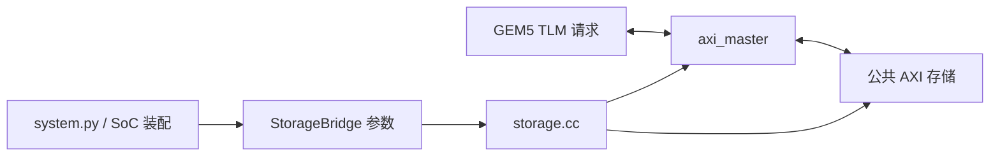

# vortex_StorageStacked/integration：阅读导航

本目录连接计算平台与独立的 axi_StorageStacked。
推荐先看构建文件和入口，再看 storage 的装配，最后看 axi_master 的请求处理。
.hh 定义数据与接口，.cc 负责具体行为；Python 文件用于 GEM5 对象声明和仿真装配。

## 逐文件入口

| 文件 | 作用 |
| --- | --- |
| [SConscript.md](SConscript.md) | 将桥接对象和代码纳入 GEM5 构建 |
| [StorageBridge.py.md](StorageBridge.py.md) | 声明 GEM5 可配置参数及 C++ 对象映射 |
| [system.py.md](system.py.md) | 组装 GEM5 SoC 并接入存储窗口 |
| [storage.hh.md](storage.hh.md) | 声明顶层桥接组件与接口 |
| [storage.cc.md](storage.cc.md) | 连接模块，管理复位、监视和结束导出 |
| [axi_master.hh.md](axi_master.hh.md) | 声明请求状态、在途队列和驱动接口 |
| [axi_master.cc.md](axi_master.cc.md) | 实现请求到 AXI 的转换与响应返回 |

## 输入和输出

输入：resolved.json、GEM5 设备存储窗口的 TLM 时序事务。
输出：AXI 五通道信号、回送 GEM5 的 TLM 响应，以及事务记录、CSV 和波形。
公共存储接收 AXI，继续完成 UCIe 传输与 MEMSIM 访问。

用户负载见 [user 导航](../user/README.md)，平台构建见 [build.sh.md](../build.sh.md)。

## 先回答四个问题，再读状态机

| 问题 | 本目录中的位置 |
|---|---|
| 程序从哪里开始运行？ | `system.py`，通过 gem5 启动 |
| 谁把时钟、信号和模块连起来？ | `storage.cc` |
| 请求还没完成时存在哪里？ | `axi_master.hh` 的 Txn、active 和队列 |
| 真实返回怎样送回设备？ | `axi_master.cc` 的完成处理 |

“主端”是提出读写的一方；“存储侧”接收请求并给出返回。
一组 `Signals` 保存双方看到的同一套信号值；两端 bind 到它，就相当于连上同一组导线。
监测器观察这组导线，记录握手，不代替设备计算或提供读数据。

TLM 保存一笔完整请求；AXI 可以把它拆成多个 burst。
本目录保留请求对象直到响应交接结束，返回的数据从实际 R 通道收集。
主机的普通内存访问不都经过这里，先确认请求是否落在 Vortex BAR 窗口。

## 把一个问题缩小到一次握手

先找上游记录的地址、方向、ID 与时间，再看 AXI 的地址握手和 B/R 返回。
不要一开始就阅读整份大 VCD。先用 CSV 找到目标时间段，再放大波形。
关于 VALID/READY、TLM 和字节掩码的基础读法见 [项目入门](../../00-先把项目跑懂.md)。
