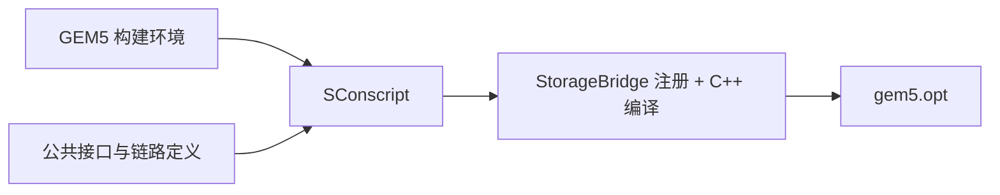

# SConscript：解释版

对应原文件：[vortex_StorageStacked/integration/SConscript](https://github.com/hy2581/vortex_StorageStacked/blob/2014e742e88dcd2d8209c4ddb86c0d6c2d0ce5c2/integration/SConscript)。本文件以原文件名加 `.md` 命名，内容为 Markdown 阅读说明。

将 integration 的 Python SimObject 与 C++ 桥接实现纳入 GEM5 构建。

## 输入与输出

输入为 GEM5 构建环境、STORAGE_STACK_ROOT 指向的公共项目，以及当前目录源码。
输出是链接进 gem5.opt 的 StorageBridge 对象与适配代码；本文件不产生用户 ELF。

## 逐段解释

| 语句 | 作用 |
| --- | --- |
| `Import('*')` | 使用上层 GEM5 构建环境及 Source、SimObject 等接口。 |
| `storage = ... storage_axi` | 定位公共 AXI 库的接口目录。 |
| `env.Append(CPPPATH=...)` | 加入 GEM5 SystemC、公共 AXI 和 AXI/flit 链路头文件目录。 |
| `link_options.py` | 读取本次构建的 UCIe 编译定义。 |
| `SimObject('StorageBridge.py', ...)` | 注册 StorageBridge，使 Python 配置能够创建对应 C++ 模块。 |
| `Source('axi_master.cc')` | 编译 TLM 请求转 AXI 信号的适配器。 |
| `Source('storage.cc', ...)` | 编译组件装配层，并附加 UCIe 编译参数。 |

## 与用户 Makefile 分别负责什么

用户 Makefile 编译要跑的 host 和 kernel；这里的 SConscript 编译“运行这些任务所需的平台部件”。
如果没有注册 StorageBridge，system.py 就不能按该类型创建桥；
如果没有编译 C++ 实现，只有 Python 参数声明也无法完成访存。

`Source(...)` 把源文件交给 SCons 构建系统；
`SimObject(...)` 让 gem5 生成 Python 与 C++ 参数之间的连接代码。
它们是构建阶段的动作，不是一笔实际读写请求。

## 修改后怎样确认范围

改参数取值，优先改 user 的 JSON；改桥实现或注册关系，回根目录重新构建。
公共存储的源码由它自己的 SConscript 参与同一次 gem5 构建，
两边都使用 gem5 内的一套 SystemC 调度，不能用另一个独立运行器的二进制替代。
