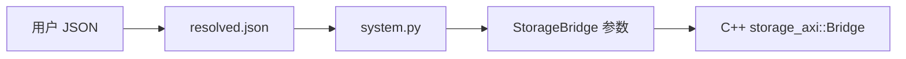

# StorageBridge.py：解释版

对应原文件：[vortex_StorageStacked/integration/StorageBridge.py](https://github.com/hy2581/vortex_StorageStacked/blob/2014e742e88dcd2d8209c4ddb86c0d6c2d0ce5c2/integration/StorageBridge.py)。本文件以原文件名加 `.md` 命名，内容为 Markdown 阅读说明。

声明 GEM5 可配置的 StorageBridge 对象，将 Python 参数映射到 C++ Bridge。

## Python 与 C++ 怎样对应

该类继承 SystemC_ScModule，type 为 StorageBridge，C++ 类型为 storage_axi::Bridge，头文件为 integration/storage.hh。
cxx_exports 使 Python 侧能调用 finish，负责仿真结束导出。
tlm 是 TlmTargetSocket(64)，64 表示桥接 socket 的绑定规格；实际 AXI 数据总线是 256 位。

## 参数声明与默认值

| 参数 | 声明默认值 | 作用 |
| --- | --- | --- |
| `planes` | 1 | AoU 资源 plane 数 |
| `replay` | false | 可重复物理 flit 错误与重传测试 |
| `memsim_standard` | hbm4 | 存储协议类型 |
| `memsim_channels` | 2 | 存储通道数量 |
| `memsim_scale` | 1 | 原生存储时钟周期倍率 |
| `memsim_queue` | 4 | 存储队列容量 |
| `memsim_slots` | 8 | 在途 AXI burst 容量 |
| `memsim_response_hold` | 0 | 响应延迟的存储 tick 数 |
| `period` | 2ns | AXI 时钟周期 |
| `base` | 0x90000000 | 存储窗口起点 |
| `size` | 8192 | 窗口字节数 |
| `outstanding` | 4 | 在途 TLM 请求容量 |
| `stalls` | true | 确定性 AXI 等待与背压 |
| `trace_dir` | 空字符串 | 输出目录 |

## 运行时取值从哪里来

system.py 创建对象时显式传入本次配置，因此上表不等于用户示例实际运行值。
例如当前示例通常使用 planes=2、memsim_channels=8、outstanding=16，地址窗口取平台的 vortex_bar。
修改运行参数应从 user/项目/config.json 入手，再通过 resolved.json 和结果中的实际配置核对。

## 参数声明怎样落到 C++ 中

例如 `period = Param.Latency('2ns', ...)` 声明一个可配置的时间参数。
system.py 创建对象时传入本次值，gem5 生成的 StorageBridgeParams 再把值交给 C++ 构造函数。
C++ 中的 `p.period` 就来自这条配置链。

`type` 用于 gem5 识别对象名称；`cxx_class` 和 `cxx_header` 定位具体实现；
`cxx_exports` 让 Python 能调用 C++ 的 finish。
这份文件建立参数与类型的联系，真正的 AXI 握手发生在 axi_master.cc。

## 用一个容易混淆的默认值举例

这里声明 `size=8192`，但 system.py 会用 Vortex BAR 的窗口大小覆盖它。
同样，声明的 `outstanding=4` 会被用户配置的默认 16 覆盖。
查某次实验的生效值，应从该次 input/resolved 和实际 gem5 配置确认，
不要只引用类声明的初始值。

64 位 TLM socket 用于接口匹配；AXI 的数据宽度由公共信号定义决定，当前是 256 位。
