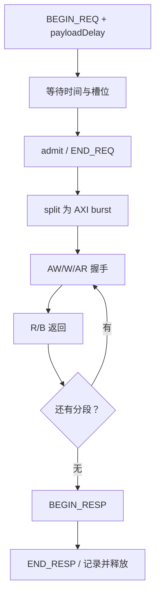

# axi_master.cc：gem5 的读写请求怎样变成 AXI 信号

对应原文件：[vortex_StorageStacked/integration/axi_master.cc](https://github.com/hy2581/vortex_StorageStacked/blob/2014e742e88dcd2d8209c4ddb86c0d6c2d0ce5c2/integration/axi_master.cc)。

gem5 发来一笔读写请求（TLM 请求）后，这个文件负责把它转换成 AXI 信号，
等存储返回，再把结果交回 gem5。请求太长时，还会拆成几段发送。

## 一次读写请求怎样完成

| 顺序 | 代码中的步骤 | 实际发生了什么 |
| --- | --- | --- |
| 1 | `BEGIN_REQ` | gem5 提交请求。桥先保存它，并算出最早可以处理的时间。 |
| 2 | `admit`、`END_REQ` | 等数据到达且有空位时，桥接收请求，分配 AXI ID，并告诉 gem5“请求已接收”。此时读写还没完成。 |
| 3 | `split` | 按地址对齐、每段最多 256 拍和不跨 4 KiB 的要求，决定要分几段。 |
| 4 | `enqueueSegment` | 把读地址放进 AR 队列；写地址和写数据分别放进 AW、W 队列。 |
| 5 | `tick`、`drive` | 每到一个时钟周期，检查双方是否准备好；准备好才发送下一拍或接收返回数据。 |
| 6 | `finishSegment` | 一段完成后继续下一段；全部完成后，记下 AXI 完成时间。 |
| 7 | `BEGIN_RESP` | 桥把读到的数据或写入结果交给 gem5。 |
| 8 | `END_RESP` | gem5 确认收到结果。桥写入 `transactions.csv`，释放这笔请求占用的资源。 |

## 一个请求何时要拆开

初始每拍长度为 32 字节。若起始地址未对齐或剩余长度不足，就将每拍长度减半，直到能够传输。
每段拍数取“剩余完整拍数、256、到下一个 4KiB 边界的拍数”三者最小值。
每段记录原始 payload 内偏移，保证分段后的数据仍可还原到原请求。
LEN=拍数-1，SIZE=log2(每拍字节数)，burst 类型为 INCR。

所以 gem5 的一笔请求可能被拆成多个 AXI burst（一段连续传输）。
`transactions.csv` 的 `segments` 字段记录拆出了几段。

## 接收前检查什么

请求必须是读或写，数据指针有效，长度在 1..65536 字节内，地址范围不能溢出。
streaming_width 必须覆盖整个 payload；提供字节使能时，掩码长度必须非零。
不满足条件的请求返回 TLM_BURST_ERROR_RESPONSE，不驱动正常 AXI 访问。
有效请求收到非零 RRESP/BRESP 时转换为 TLM_ADDRESS_ERROR_RESPONSE。

## 五类信号和等待

AW 是写地址，W 是写数据，AR 是读地址；它们各有等待队列。
W 按队列顺序发送。开启 `stalls` 后，程序会根据 ID 有规律地让 AW 或 W 多等 3 个周期，以检查等待时是否仍能正确读写。
WSTRB 根据 payload 字节使能生成，WLAST 根据段内拍数生成；R 返回检查 RLAST，并只更新掩码允许的字节。
`RREADY` 和 `BREADY` 会按固定周期暂时关闭接收。这样每次运行都能重复同样的等待情况。

如果同时处理的请求已经达到上限，新请求先等待，不能丢掉。`capacityDenials` 记录了遇到容量上限的次数。
`pendingAt` 记录请求最早可以开始的时间；到了这个时间且有空位，桥才接收它。

## 输出记录与其他接口

transactions.csv 包含 ID、读写方向、地址、字节数、开始/接受/AXI 完成/END_RESP 时间、分段数、来源属性和响应状态。
AXI 完成与 TLM END_RESP 是两个独立时刻，不能把它们混为一列延迟。

代码不开放 DMI（直接访问内存）。调试和阻塞式接口只会在请求队列排空后使用；
目前它们不会替代正常的读写路径。程序运行中的数据仍要经过 AXI 和存储，等待实际返回。

## 三个拆分请求的例子

| gem5 发来的请求 | 实际分段 | 为什么 |
|---|---|---|
| 从 `0x90000000` 读 64 字节 | 一段，每拍 32 字节，共 2 拍 | 起址与长度都满足总线宽度 |
| 从 `0x90000000` 读 12 字节 | 第一段 8 字节，第二段 4 字节 | 每拍长度取能满足对齐和剩余长度的 2 的幂 |
| 从 `0x90000ff0` 读 32 字节 | 两段，各 16 字节 | 首地址离 4 KiB 边界只剩 16 字节 |

第二个例子中，一笔 TLM 读产生两个 AR 和两个单拍 R。
统计时应把 transactions 的 segments 相加，再与 AXI 地址握手数对照。
`SIZE` 是每拍字节数的 log2，`LEN` 是拍数减一，不能把字段本身当成字节数或拍数。

## 请求什么时候才算完成

| 代码中的名字 | 实际发生了什么 |
|---|---|
| `BEGIN_REQ` | gem5 把请求交给桥。桥先收下，可能还要等待。 |
| `END_REQ` | 桥确认接收请求，可以开始处理；读到的数据此时还没返回。 |
| `BEGIN_RESP` | 存储处理完后，桥把数据或写入结果发回 gem5。 |
| `END_RESP` | gem5 确认收到结果，这笔请求才正式结束。 |

例如，`END_REQ` 只表示“桥接收了请求”，不能当成“数据已经读回来”。
如果请求自带延迟，桥还要等到 `pendingAt` 指定的时间，并等到有空位，才会开始处理。
忽略这段等待，会让读写值看起来正确，但请求发出得过早。

## 字节掩码怎样控制读写

写请求用字节使能生成 WSTRB，避免覆盖不该写的字节。
读请求收到 `RDATA` 后，也只更新 gem5 指定的有效字节。
`byte-enable` 数组可能被重复使用，因此桥处理这笔请求期间，它必须一直有效。

## 等待时间花在哪一步

- `accepted_tick - begin_tick`：进入桥后等待接纳的时间。
- `axi_done_tick - accepted_tick`：转换、AXI 与存储链路处理时间。
- `end_resp_tick - axi_done_tick`：结果已准备好后，把结果交回 gem5 所花的时间。

三者都使用同一 fs 时间基准，但描述不同阶段。
直到 `END_RESP`，这笔请求的时间记录才完整。最后一个读数据字（`RLAST`）到达后，gem5 可能还要等一段时间才确认收到结果。
