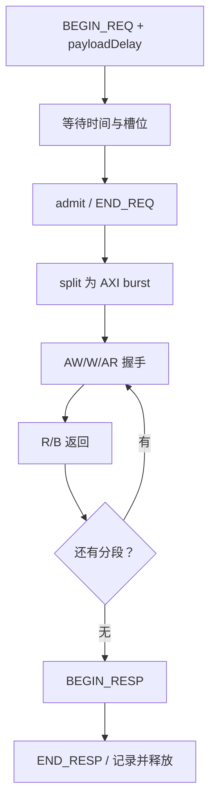

# axi_master.cc：解释版

对应原文件：[vortex_StorageStacked/integration/axi_master.cc](https://github.com/hy2581/vortex_StorageStacked/blob/2014e742e88dcd2d8209c4ddb86c0d6c2d0ce5c2/integration/axi_master.cc)。本文件以原文件名加 `.md` 命名，内容为 Markdown 阅读说明。

把 GEM5 的 TLM 请求分成合法 AXI burst，处理握手、返回数据和事务生命周期。

## 一笔事务怎样完成

| 顺序 | 动作 |
| --- | --- |
| 1. BEGIN_REQ | 保存 pending 并 acquire payload；将事务延迟与 payloadDelay 加到可接收时刻。 |
| 2. admit | 在数据已到达且 active 未达 slots 时分配空闲 AXI ID，校验请求并回应 END_REQ。 |
| 3. split | 把数据范围切分成满足对齐、每 burst 最多 256 拍、不跨 4KiB 的段。 |
| 4. enqueueSegment | 读请求进入 AR 队列；写请求分别进入 AW/W 队列。 |
| 5. tick + drive | 按时钟握手推进拍数，使用 mask 写 WSTRB 或抽取读返回字节。 |
| 6. finishSegment | 有下一段则继续；全部完成后记录 axiDone，并进入响应队列。 |
| 7. BEGIN_RESP | 一次只向 TLM 发起方返回一笔响应，等待其确认。 |
| 8. END_RESP | 写 transactions.csv，释放 payload 和 ID，completed 加一。 |

## split 的分段规则

初始每拍长度为 32 字节。若起始地址未对齐或剩余长度不足，就将每拍长度减半，直到能够传输。
每段拍数取“剩余完整拍数、256、到下一个 4KiB 边界的拍数”三者最小值。
每段记录原始 payload 内偏移，保证分段后的数据仍可还原到原请求。
LEN=拍数-1，SIZE=log2(每拍字节数)，burst 类型为 INCR。

因此一笔 TLM 事务可能对应多个 AXI burst；transactions.csv 的 segments 字段记录这一关系。

## 接收前检查什么

请求必须是读或写，数据指针有效，长度在 1..65536 字节内，地址范围不能溢出。
streaming_width 必须覆盖整个 payload；提供字节使能时，掩码长度必须非零。
不满足条件的请求返回 TLM_BURST_ERROR_RESPONSE，不驱动正常 AXI 访问。
有效请求收到非零 RRESP/BRESP 时转换为 TLM_ADDRESS_ERROR_RESPONSE。

## 五通道与背压

AW、W、AR 有各自队列，W 按队列顺序输出。stalls 开启时，按 ID 奇偶交替让 AW 或 W 延迟 3 周期。
WSTRB 根据 payload 字节使能生成，WLAST 根据段内拍数生成；R 返回检查 RLAST，并只更新掩码允许的字节。
RREADY 按 cycle%7>=3，BREADY 按 cycle%5>=2，形成可重复的背压。

在途满时继续等待而非丢弃请求，capacityDenials 记录容量阻塞。
pendingAt 必须早于当前 AXI tick 才允许接收，确保 GEM5 的 payloadDelay 已经过完。

## 输出与辅助接口

transactions.csv 包含 ID、读写方向、地址、字节数、开始/接受/AXI 完成/END_RESP 时间、分段数、来源属性和响应状态。
AXI 完成与 TLM END_RESP 是两个独立时刻，不能把它们混为一列延迟。

DMI 固定返回 false。debug 与 blocking 只在请求已排空时调用 functional；
当前 storage.cc 为 functional 安装的是命令错误响应，因此运行数据通过受时序约束的通路完成。

## split 算法的三个具体例子

| 上游请求 | 实际分段 | 为什么 |
|---|---|---|
| 从 `0x90000000` 读 64 字节 | 一段，每拍 32 字节，共 2 拍 | 起址与长度都满足总线宽度 |
| 从 `0x90000000` 读 12 字节 | 第一段 8 字节，第二段 4 字节 | 每拍长度取能满足对齐和剩余长度的 2 的幂 |
| 从 `0x90000ff0` 读 32 字节 | 两段，各 16 字节 | 首地址离 4 KiB 边界只剩 16 字节 |

第二个例子中，一笔 TLM 读产生两个 AR 和两个单拍 R。
统计时应把 transactions 的 segments 相加，再与 AXI 地址握手数对照。
`SIZE` 是每拍字节数的 log2，`LEN` 是拍数减一，不能把字段本身当成字节数或拍数。

## 四阶段握手用普通话怎么说

| TLM 阶段 | 意思 |
|---|---|
| BEGIN_REQ | 上游提出请求，桥保存它 |
| END_REQ | 桥正式接纳，请求阶段交接结束 |
| BEGIN_RESP | AXI 已完成，桥把结果交给上游 |
| END_RESP | 上游确认接收，桥可以释放资源 |

`pendingAt` 把上游的数据到达延迟也算进去。
代码只有在数据到达时间已经早于当前采样时刻、并且有容量时才 admit。
忽略这一段等待会导致“读写值看起来正确、请求发出时间却太早”。

## 读写字节使能为什么都要保留

写请求用字节使能生成 WSTRB，避免覆盖不该写的字节。
读请求收集 RDATA 时也按掩码更新上游缓冲，只改调用方声明有效的位置。
byte-enable 数组的长度可以参与循环索引；它必须在请求生命周期内有效。

## 看延迟时分开看三个差值

- `accepted_tick - begin_tick`：进入桥后等待接纳的时间。
- `axi_done_tick - accepted_tick`：转换、AXI 与存储链路处理时间。
- `end_resp_tick - axi_done_tick`：结果已准备好后，交回上游所花的时间。

三者都使用同一 fs 时间基准，但描述不同阶段。
只有等到 END_RESP，事务记录才完整，不能在 RLAST 到达时就把所有上游等待都忽略。
