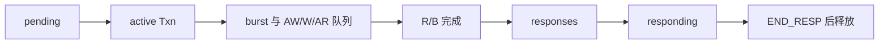

# axi_master.hh：解释版

对应原文件：[vortex_StorageStacked/integration/axi_master.hh](https://github.com/hy2581/vortex_StorageStacked/blob/2014e742e88dcd2d8209c4ddb86c0d6c2d0ce5c2/integration/axi_master.hh)。本文件以原文件名加 `.md` 命名，内容为 Markdown 阅读说明。

声明 TLM 到 AXI 的适配器，以及请求属性、分段和在途队列。

## 输入与输出

输入为 TLM 非阻塞事务、AXI 时钟/复位、容量 slots 和 stalls 开关。
输出为 AXI 五个通道信号，并把实际读返回数据或写响应送回 TLM 发起方。
socket 的 64 是 TLM 端口匹配规格，实际请求可以更长，AXI 数据总线宽度由公共 DataBits 定义为 256 位。

## 三个数据结构

| 结构 | 保存的内容 |
| --- | --- |
| `RequestAttributes` | 字节使能、requestor、stream/substream、存在标志和 payloadDelay；clone/copy_from 保留扩展信息。 |
| `Burst` | 分段地址、原始 payload 内的偏移、每拍字节数、拍数与 SIZE 编码。 |
| `Txn` | 原始 payload、AXI ID、所有 burst、当前段与读写拍序号、通道最早发出周期和时间戳。 |

## 队列之间的关系

pending 保存尚未接收的一个 TLM 请求，pendingAt 决定数据何时可用。
active 按 AXI ID 保存已经接收的请求。awq、wq、arq 分别保存待驱动通道。
responses 保存 AXI 已完成、等待返回 TLM 的请求；responding 表示已经发出 BEGIN_RESP、尚未收到 END_RESP 的请求。
只有最后的 END_RESP 到来后，payload 和该事务的在途资源才释放。

## 函数分工

| 函数 | 工作 |
| --- | --- |
| `transport` | 处理 BEGIN_REQ 与 END_RESP |
| `admit` | 检查到达时刻、容量与参数，正式接收请求 |
| `split` | 按对齐、最大拍数和 4KiB 边界分段 |
| `enqueueSegment / finishSegment` | 送入一段与推进下一段 |
| `tick / drive` | 采样握手并驱动信号 |
| `respond` | 发出 BEGIN_RESP |
| `debug / blocking / dmi` | 处理辅助接口；DMI 固定关闭，功能访问由装配层回调决定 |

## 为什么一笔请求需要保存这么多状态

请求发出后可能要等待很多周期，函数早已返回，数据却还没有回来。
Txn 把请求的地址、ID、进度和时间留在内存里，让后续时钟事件继续处理同一件事。

`std::map` 可以按 ID 找到请求；`std::deque` 保存待处理编号的先后顺序。
AW、W、AR 有不同队列，因为“地址已传走”与“数据已传走”可以发生在不同周期。
W 按队列顺序发送，不因为它没有 WID 就能随意改变写数据次序。

例如一个 12 字节 TLM 请求可以有两个 Burst。Txn 指向原请求，
Burst 记住它负责的是其中哪几个字节。先完成第一段，再继续下一段，最后统一返回。

## 先辨认状态，再读函数

| 状态 | 含义 |
|---|---|
| 等待接纳 | 上游想发送，桥可能还没有容量 |
| 在途 active | 桥已经接收，等待地址、数据或返回完成 |
| AXI 返回就绪 | 存储侧数据或写响应已经到了 |
| 上游完成 | 响应已经交回，才能释放相应资源 |

pending、active、responses、responding 对应不同阶段。
`BEGIN_RESP` 发出后也不能立刻释放 payload，还要等 `END_RESP`。
实现中的 acquire/release 维持这段生命周期。
