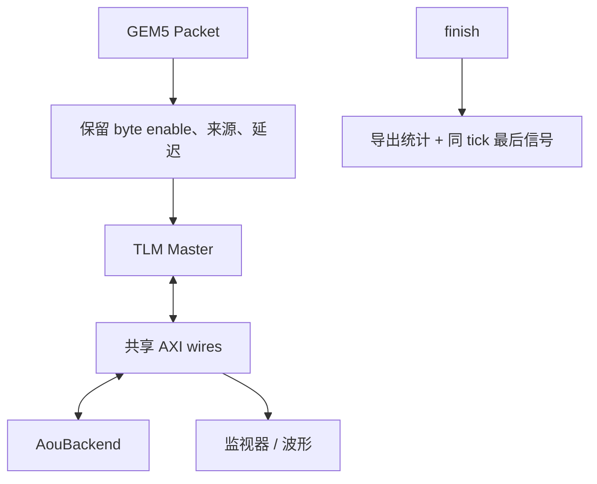

# storage.cc：解释版

对应原文件：[vortex_StorageStacked/integration/storage.cc](https://github.com/hy2581/vortex_StorageStacked/blob/2014e742e88dcd2d8209c4ddb86c0d6c2d0ce5c2/integration/storage.cc)。本文件以原文件名加 `.md` 命名，内容为 Markdown 阅读说明。

实现 GEM5/SystemC 组件装配，保留请求属性并将 AXI 信号接入公共存储。

## 构造时完成的连接

根据 StorageBridgeParams 创建时钟、Master、TLM wrapper 和监视器。
将参数转成 StorageConfig 后创建 AouBackend，将两端接到同一套 AXI wires。
当前公共链路使用 1..1023 的请求 ID，构造时限制在途数并设置 Master.maxId。
同时记录编译时 UCIe 参数，创建 1 fs 精度的 axi_wave.vcd。

## Packet 转换钩子保留哪些属性

| 属性 | 处理方式 |
| --- | --- |
| 字节使能 | 复制到 RequestAttributes.enables，由 payload 扩展持有，避免指针失效；供读掩码和 WSTRB 使用。 |
| requestor | 记录请求来源 ID。 |
| stream / substream | 记录是否存在以及对应编号。 |
| payloadDelay | 保留 GEM5 数据到达延迟，供 Master 决定何时可接收。 |
| 特殊命令 | 对 atomic、LL/SC、locked RMW、swap、cache maintenance 标记为不支持的命令，后续按错误返回。 |

## 其余方法

| 函数或设置 | 行为 |
| --- | --- |
| `reset` | 低电平保持 3.5 个 AXI 周期，再等待后端 ready，随后释放。 |
| `gem5_getPort` | 只接受 tlm 端口名，返回对应 wrapper。 |
| `checkClock` | 每个 AXI 上升沿断言 SystemC 时间值等于 GEM5 curTick。 |
| `master.functional` | 对功能访问返回命令错误；没有通过另一份私有内存绕过时序链路。 |
| `finish` | 只执行一次，导出 AXI 统计、后端记录和最终波形。 |

## 结束时为什么补一次波形记录

GEM5 可能在 SystemC 最后一个低优先级 trace 事件执行前退出。
finish 在同一个仿真 tick 调用 trace(false) 记录当前信号，再关闭 VCD，避免遗漏最后一次变化。
这一操作补写当前观察值，不推进仿真时间。

## 用默认时钟算一次复位

默认 AXI 周期为 2 ns。`3×周期 + 半周期` 等于 7 ns。
模块至少保持这段复位时间，之后还检查公共存储链路是否 ready。
若链路训练尚未完成，继续按周期等待，而不是到 7 ns 就强行开始发请求。

`bind(wires)` 把两端的对应端口接到同一组信号。
主端写入 awvalid，存储侧就从绑定的同一信号读取它；awready 的方向相反。
这不是先复制一份 trace 再由另一端重放。

## 运行完成后的收尾顺序有什么意义

收尾时先整理已完成访问和各层记录，再关闭波形。
`accepted` 表示正式接纳多少请求，`completed` 表示交回多少响应，
`maxActive` 是运行中观察到的最大在途数，`idle` 表示是否已排空。

这些统计与 JSON 中的容量上限是两类信息：容量是“允许多少”，统计是“实际发生多少”。
这里还检查 gem5 tick 与 SystemC 时间相同。两套计时若不一致，单看返回数值可能发现不了延迟错位。
最后补记同一 tick 的信号值，是保存已有信号状态，不会额外推进模型时间。
