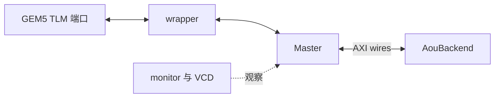

# storage.hh：解释版

对应原文件：[vortex_StorageStacked/integration/storage.hh](https://github.com/hy2581/vortex_StorageStacked/blob/2014e742e88dcd2d8209c4ddb86c0d6c2d0ce5c2/integration/storage.hh)。本文件以原文件名加 `.md` 命名，内容为 Markdown 阅读说明。

声明 GEM5 可实例化的 Bridge 模块，封装 TLM 入口和公共 AXI 存储连线。

## 成员与接口

| 成员或方法 | 用途 |
| --- | --- |
| `Bridge(StorageBridgeParams)` | 接收 Python SimObject 参数并创建 C++ 对象 |
| `gem5_getPort` | 向 GEM5 暴露名为 tlm 的端口 |
| `Master master` | 接收 TLM payload，产生五通道 AXI 信号 |
| `TlmTargetWrapper<64> wrapper` | 将 SystemC socket 包装为 GEM5 可连接端口 |
| `Signals wires` | 连接 Master、后端和监视器的 AXI 信号 |
| `AouBackend aou` | 公共 AXI/UCIe/MEMSIM 存储后端 |
| `clock / resetn` | AXI 时钟和复位 |
| `AxiMonitor / vcd / directory` | 统计监视、波形句柄与输出位置 |
| `reset / checkClock / finish` | 复位、检查仿真时钟同步、导出并收尾 |

## 怎样使用

system.py 创建 StorageBridge 后，GEM5 根据参数构造本类并连接 tlm 端口。
运行时请求进入 wrapper，再交给 Master；响应按同一路径返回。
Python 调用 finish 触发最终导出。具体连线与导出逻辑见 [storage.cc.md](storage.cc.md)。

## 从“对象里有什么”理解这个头文件

头文件先列出成员，实际初始化次序和行为在 [storage.cc](storage.cc.md)。
`public` 下的方法允许外部调用；`private` 下的成员由这个模块自己管理。
构造函数创建组件，析构函数在对象销毁时处理资源。

| 成员类别 | 可以怎样想象 |
|---|---|
| clock、resetn | 告诉各部件什么时候行动、什么时候仍在初始化 |
| wires | 两端共享的信号线 |
| Master | 翻译并发送上游读写请求 |
| 公共后端 | 收到 AXI 请求后处理链路与在线内存 |
| monitor、波形句柄 | 旁观者，把发生过的事情记录下来 |
| finished | 记住是否已经收尾，避免重复关闭或重复导出 |

`finish` 用来写出最后状态；不能在请求还没完成时把它当成取消请求的快捷方式。
gem5 根据 StorageBridgeParams 构造 Bridge；Python 侧通过导出接口调用 finish。
`TlmTargetWrapper<64>` 是连接 TLM 入口的包装类型，这个 64 不决定 AXI 数据宽度。
