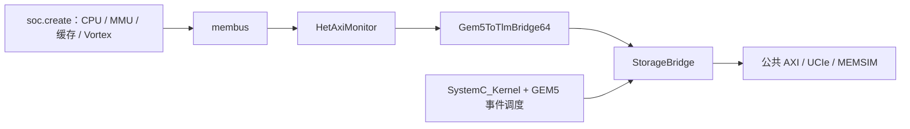

# system.py：gem5 怎样启动 CPU、GPU 和存储

对应原文件：[vortex_StorageStacked/integration/system.py](https://github.com/hy2581/vortex_StorageStacked/blob/2014e742e88dcd2d8209c4ddb86c0d6c2d0ce5c2/integration/system.py)。

gem5 从这里创建 CPU、GPU 和存储桥，再设置它们之间的连接。

## 输入与输出

输入由 --config 指定，为运行入口生成的 resolved.json。
soc.create 创建 GEM5 CPU、MMU/TLB、CPU 缓存、Vortex 设备、主机进程和地址分区。
本文件把设备 BAR 窗口接到 StorageBridge，执行仿真并生成 completion.json。

## main 的执行步骤

| 步骤 | 作用 |
| --- | --- |
| 读取配置与输出路径 | 使用 m5.options.outdir 指定的运行结果目录。 |
| `create(config, output)` | 从 third_party/gem5/runtime/soc.py 构建 SoC 和 CPU 主机进程。 |
| 读取 vortex_bar | 选取设备存储访问应路由到的 GEM5 物理地址窗口。 |
| 创建 StorageBridge | 传入 AXI、MEMSIM 参数和输出目录，配置公共存储接收端。 |
| 创建 Gem5ToTlmBridge64 | 将 GEM5 时序请求转换为 TLM，连接 StorageBridge 的 tlm 端口。 |
| 创建 HetAxiMonitor | 记录主机/设备来源与时钟信息，并放在总线与桥接器之间。 |
| 创建 Root 与实例化 | 使用 SE 模式 full_system=False，并将 SystemC_Kernel 纳入 GEM5 调度。 |
| 映射设备窗口 | 将 vortex_cp、vortex_bar 映射到主机进程，按 4KiB 补齐长度并设为不可缓存。 |
| 运行与导出 | 模拟至退出或 max_ticks；正常退出后调用 StorageBridge.finish，写 completion.json。 |

## CPU 和 GPU 分别负责什么

GEM5 CPU 执行 host.elf，模拟 CPU 的地址转换与 L1/L2 访问；Vortex SimX 执行 program.vxbin 中的 GPU 指令。
设备访问经 GEM5 的 Vortex BAR 窗口进入这个存储桥。CPU 普通代码、堆栈和主存访问按 SoC 自身的主机内存路径处理。
因此不能把所有 CPU 流量都理解为一定经过公共 AXI 存储。

当前 BAR 起点为 0x100000000、大小 4 GiB，GPU 地址 0x90000000 映射后为 0x190000000。
地址转换在平台中完成，axi_master 按接收到的地址驱动 AXI。

## 什么时候算运行结束

GEM5 退出码必须为 0，退出原因必须包含 exiting with last active thread context。
未满足时写入失败 completion 并抛出错误。正常完成后，外层 run.sh 继续做数值与协议验证。

## 代码分别在哪台模拟设备上运行

| 位置 | 运行什么 |
|---|---|
| 现实 Linux 主机 | 启动脚本、gem5 仿真进程、结束后的 Python 校验器 |
| gem5 模拟 CPU | 用户 host.elf，负责线程准备、上传、发射和回读检查 |
| Vortex SimX | 用户 program.vxbin 中的 GPU 指令 |

本文件由 gem5 内嵌的 Python 环境运行，不能把 `python3 system.py` 当成完整启动方式。
运行入口会给出 gem5 可执行文件、输出目录及本次 resolved 配置。

## 用一个地址解释 BAR 映射

GPU 程序中的 `0x90000000`，进入当前平台物理窗口后是
`0x100000000 + 0x90000000 = 0x190000000`。
所以看 AXI 日志时出现更大的地址，不一定是写错位置；
先判断日志记录的是设备地址，还是映射后的 gem5 物理地址。

`process.map` 建立模拟主机进程访问 CP/BAR 的映射。
它不会把所有 CPU 的栈、堆和代码都搬到公共 AXI 后端。
普通主机内存与 GPU 窗口在平台中分别路由。

## 怎样确认请求确实到了存储

HetAxiMonitor 用于区分请求来自哪里；它记录的来源信息不能替代线上的 VALID/READY。
判断某拍是否真的握手，查看 axi_events.csv 与 axi_wave.vcd。
判断计算是否结束，查看 completion；判断结果和链路是否正确，再查看最终 summary。
