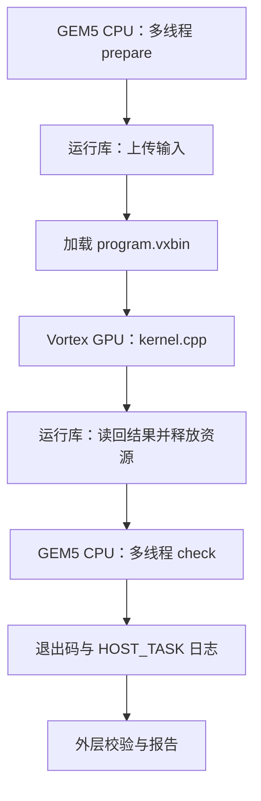

# host.cpp：CPU 怎样准备和检查数据

对应原文件：[vortex_StorageStacked/user/llm/src/host.cpp](https://github.com/hy2581/vortex_StorageStacked/blob/2014e742e88dcd2d8209c4ddb86c0d6c2d0ce5c2/user/llm/src/host.cpp)。

这段程序在 gem5 模拟的 CPU 上运行：先准备输入，再启动 GPU，最后读取并检查结果。

## 它在哪里运行

本文件构建为 x86-64 的 `host.elf`，在 GEM5 模拟的 CPU 上运行。
它调用 Vortex 运行库，加载 `program.vxbin` 并启动 GPU；计算内核见同目录的 [kernel.cpp.md](kernel.cpp.md)。
命令行输入是一个设备镜像路径，约定为 `host.elf program.vxbin`。

## on_cpu_cores：多核工作怎样体现

这段辅助函数创建 `HOST_CPU_COUNT - 1` 个新线程，加上参与工作的主线程，共 `HOST_CPU_COUNT` 个线程。
线程先通过 barrier 同步，再处理自己负责的范围：

```text
begin = count * worker / HOST_CPU_COUNT
end   = count * (worker + 1) / HOST_CPU_COUNT
处理区间为 [begin, end)
```

prepare 在 GPU 队列创建前执行，check 在队列释放后执行，减少与运行库线程争用 CPU 上下文。
输出中的 `HOST_TASK` 记录阶段、worker、实际 tid 和数据范围；worker 编号不是固定 CPU 核编号。
是否有多个核真正执行，可结合 `host_summary.json` 和 GEM5 `stats.txt` 查看。

当前 count=1004、CPU=4，每个 CPU 工作线程分片处理 251 个权重字。

## main 的执行顺序

| 阶段 | 本文件实际完成的工作 |
| --- | --- |
| CPU 准备 | 多线程将 model_image 复制到 weights 缓冲。 |
| 创建设备资源 | 打开 Vortex、创建队列，预留设备地址 0x90000000 起的 0x60000 字节缓冲。 |
| 上传输入 | 将权重写到缓冲偏移 0，将 prompt 写到偏移 0x40000，并等待事件完成。 |
| 加载与发射 | 加载 argv[1] 中的设备镜像，获取 main 内核，发射 APP_WORKGROUPS 个组，每组 1 个线程。 |
| 等待与读回 | 等待 GPU 事件结束，readback_all 读取 SDK 规定的实际结果区域。 |
| 释放资源 | 释放内核、模块、缓冲和队列，输出设备性能数据并释放设备。 |
| CPU 检查 | 多线程逐字比较返回权重；再检查生成 token 是否落在词表范围，读取 report[3]。 |
| 返回退出码 | 打印 HOST_CHECK_ERRORS 和 DEVICE_STATUS；错误数为 0 且状态为 0x600d0000 时返回 0。 |

## 内存、输入与输出的衔接

设备缓冲从 `0x90000000` 开始，大小 `0x60000`，CPU 侧上传和读回使用“缓冲 + 偏移”。
GPU 源码使用对应设备地址；例如偏移 `0x10000` 对应 `0x90010000`。
平台把这些设备地址映射到 GEM5 的 Vortex BAR 窗口，之后由 integration 转成 AXI 请求。

`project_config.h` 提供 HOST_CPU_COUNT、APP_WORKGROUPS 和负载输入常量；
`host_io.h` 提供 CHECK、wait_event 和 readback_all 等公共辅助操作。
这些编译依赖由 SDK 提供，无需逐份复制进项目。

## 主机检查与模型校验如何分工

此文件负责输入上传、发射、数据回收、返回权重比较、token 范围检查和设备完成状态。
LayerNorm、注意力、FFN 与贪心选择在 GPU kernel.cpp 中执行。
外层 Python 校验器再按独立参考比较完整 KV、中间值和 token；该参考不在 GEM5 模拟 CPU 上运行。



## 这段 Lambda 函数在做什么

```cpp
on_cpu_cores("prepare", LLM_WEIGHT_WORDS, [&](unsigned i) {
    weights[i] = model_image[i];
});
```

这是本文件准备权重的实际片段。对每个下标 i，把模型数组的一个数复制到 CPU 权重缓冲。
整段 `[&](unsigned i) { ... }` 可以理解成临时定义的“处理第 i 项”操作：
`[&]` 允许它直接使用外面的数组；`i` 告诉它现在该处理哪一项。
`on_cpu_cores` 把这段操作命名为 `work`，每次执行 `work(i)` 就运行一次花括号中的代码。

这时仍在模拟 CPU 中执行。启动 GPU 程序 是后面的 `vx_enqueue_launch`，不是这里的 `work(i)`。

## 四个工作线程怎样分工

LLM 准备 1004 个权重存储字。4 个线程分别处理 `[0,251)`、`[251,502)`、
`[502,753)`、`[753,1004)`，每人 251 个。
这里的操作是复制和回读检查权重；Transformer 的前向计算在 GPU kernel 中。

`[begin,end)` 表示包含 begin、不包含 end。四片拼起来正好覆盖全部元素。
`pthread_barrier_wait` 让大家在起点集合；`join` 等各线程做完后再往下走。
主线程也参与，所以只额外创建 `HOST_CPU_COUNT-1` 个线程。

worker 是任务编号，tid 是运行时线程号，CPU 核号来自模拟器统计。
当前代码没有把 worker 永久绑定到同号核心；不要把三者混在一起。

## CPU 什么时候能读取 GPU 的结果

| 操作 | 为什么要等对应 event |
|---|---|
| `vx_enqueue_write` | 输入要先写到设备可读的位置，GPU 才能使用 |
| `vx_enqueue_launch` | GPU 计算尚未结束时不能提前按最终结果检查 |
| `readback_all` | 需要实际读回的字节，不能用原始 model_image 假装设备返回 |

`CHECK` 检查 API 是否成功；任务数值还由后面的比较和外层参考检查。
源码使用“缓冲 + 偏移”定位设备数据，例如偏移 `0x10000` 对应设备地址 `0x90010000`。

LLM 的 CPU 端检查上传权重读回一致、token 在词表范围内以及设备状态。
外层 Python 参考进一步核对 K/V、中间向量与正确 token。
“编号没越界”和“预测结果正确”是两种检查，缺一不能替代另一种。

## 修改时最容易漏掉的地方

新增输出地址时，要让构建器生成的回读范围覆盖该地址，主机程序也要正确解释返回数据。
改变数据规模时，同时检查准备数组、GPU 发射范围、读取长度和比较循环。
不能只改 kernel 的一行运算，就假设主机和检查器也会自动理解新算法。
