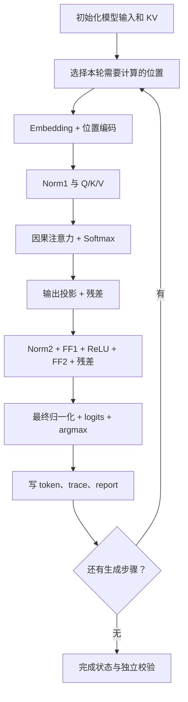

# kernel.cpp：解释版

对应原文件：[vortex_StorageStacked/user/llm/src/kernel.cpp](https://github.com/hy2581/vortex_StorageStacked/blob/2014e742e88dcd2d8209c4ddb86c0d6c2d0ce5c2/user/llm/src/kernel.cpp)。本文件以原文件名加 `.md` 命名，内容为 Markdown 阅读说明。

实现单层字符 Transformer 的初始化、prefill、因果注意力、FFN 和贪心生成。

## 运行位置与输入输出

本文件编译为 Vortex 的 RV32 设备程序，由 GPU 执行。
输入是 `tinyllm.h` 提供的模型定义，以及 `project_config.h` 中的 prompt、生成长度和 KV 开关。
输出包括生成 token、K/V 缓存、中间值和报告区状态，均通过源码中的内存指针读写。

计算使用 FP32。模型采用字符级贪心生成：每轮选择 logits 最大的字符编号。

## 先看内存分区

| 指针 | 设备地址 | 元素类型 | 用途 |
| --- | --- | --- | --- |
| `weights` | `0x90000000` | float | 1004 个 FP32 存储字，包含模型权重和尾部填充 |
| `keys` | `0x90010000` | float | 16 个位置 × 8 维的 K 缓存 |
| `values` | `0x90020000` | float | 16 个位置 × 8 维的 V 缓存 |
| `trace` | `0x90030000` | float | 每个位置预留 148 个 FP32 字，保存中间值 |
| `tokens` | `0x90040000` | uint32_t | 输入 token，以及下一轮还需要处理的生成 token |
| `report` | `0x90050000` | uint32_t | 完成标志、错误计数、生成 token 和计算次数 |

这些是同一地址空间中的六个逻辑区域；不会因为分成六段，就自动对应六个 MEMSIM 通道。地址规划直接体现在本文件中。

设备地址经过平台 BAR 映射进入 GEM5 物理地址空间；本配置的 `0x90000000` 对应 `0x190000000`。CPU 普通代码、栈和堆有自己的内存路径。

## 按什么顺序读函数

| 函数 | 作用 |
| --- | --- |
| `kernel_main()` | 程序入口：初始化、逐轮生成、记录完成状态。先读它就能看懂整体顺序。 |
| `forward(pos)` | 计算一个 token 位置的完整 Transformer，并返回下一字符的候选编号。 |
| `norm(...)` | LayerNorm：均值、方差、epsilon=1e-5，再应用权重和偏置。 |
| `linear(...)` | 输入向量乘行主序权重矩阵，可附加偏置。矩阵索引为 matrix + i * cols + j。 |
| `dump(...)` | 把某阶段中间向量写入 trace 对应位置，便于独立核对。 |

## 入口怎样生成多个字符

1. CPU 端 host.cpp 已上传 weights 和 prompt；GPU 入口清空 K/V，然后开始推理。
2. 第一轮遍历整个 prompt，称为 prefill；以最后位置的 forward 返回值作为第一个生成 token。
3. 后续轮次开启 KV cache 时只处理新增位置；关闭时从位置 0 重算当前完整前缀。
4. 将每轮选出的编号写入 `report[16 + step]` 并读回检查；还有下一轮时，把它写入 tokens。
5. 保存累计 forward 次数、错误数和完成标志。

对默认 4 字符 prompt 和 3 轮生成，开启 KV 时 forward 调用数为 `4 + 1 + 1 = 6`；
关闭时为 `4 + 5 + 6 = 15`。两种方式应得到相同的 token 序列。

## forward 的计算顺序

1. 读取当前 token，将词嵌入与位置嵌入相加。
2. 做第一层 LayerNorm，再分别计算 Q、K、V，把当前 K/V 写入缓存。
3. 每个注意力头只访问位置 `0..pos`，不会看到未来 token；计算缩放点积。
4. 减去当前最大分数后求指数并归一化，得到 Softmax 概率，再对 V 加权。
5. 做注意力输出投影并加残差；第二层 LayerNorm 后依次执行 FF1、ReLU、FF2，再加残差。
6. 最终 LayerNorm 和词表投影产生 17 个 logits，检查数值并返回最大值的位置。

每个主要阶段调用 dump 保存中间值；程序还检查 token 范围、概率和及 logits 数值范围。

本实现使用 SDK 提供的 `device_sqrt` 和 `device_exp`。

## 报告如何读

| uint32 索引 | 含义 |
| --- | --- |
| `report[0]` | `0x4c4c4d31`：报告格式标记 |
| `report[1]` | `1`：初始化完成 |
| `report[2]` | `2`：全部生成步骤完成 |
| `report[8]` | 程序内累计错误数 |
| `report[16 + step]` | 第 step 轮选出的 token 编号 |
| `report[32 + step]` | `0x70000000 + step`：该轮开始标记 |
| `report[64 + step]` | `0x71000000 + step`：该轮结束标记 |
| `report[96 + step]` | 截至该轮结束累计调用 forward 的次数 |
| `report[3]` | `0x600d0000` 成功；`0xbad00000` 失败 |

GPU 写入 report[3] 后返回；CPU 主机程序读取该状态和实际返回数据。LLM 当前只发射一个工作组、一个线程，CPU 的输入准备与返回检查另外使用多个线程。

完整通过还需要运行入口调用独立参考校验器，比较实际权重、KV、中间值和 token，再检查存储链路。该 Python 参考运行在外层主机上。



## 先用一个位置理解 forward

`forward(pos)` 表示“把第 pos 个输入位置完整计算一遍”。
假设 `pos=2`、该位置字符为 d，则 token ID 是 6。
Embedding 从权重表中取第 6 行的 8 个数，位置表取第 2 行的 8 个数，
对应相加形成当前特征向量。后续计算都从这 8 个数开始。

```cpp
x[j] = weights[W_EMBEDDING + id * LLM_DIM + j]
     + weights[W_POSITION + pos * LLM_DIM + j];
```

这里 id 选“哪个字符”，pos 选“第几个位置”，j 选这一行的第几个数。
它们的作用不同。对 `id=6,pos=2,j=0`，两个元素下标分别为
`0+6×8=48` 和 `136+2×8=152`。

## linear 里的两层循环在算什么

每个输出数是一串“相乘后相加”。用教学用的小向量 `[2,3]` 举例：

```text
输入 x = [2, 3]
权重矩阵的两行 = [1, 4] 和 [2, 5]
第 0 个输出 = 2×1 + 3×2 = 8
第 1 个输出 = 2×4 + 3×5 = 23
```

这是解释索引的算术例子，不是当前模型的一组实测权重。
代码 `matrix + i*cols + j` 用 i 选择矩阵的输入行，用 j 选择输出列，
与上面的逐项累加对应。有 bias 时再加对应偏置。

## 注意力怎样使用已有内容

当前位置的 Q 和先前各位置的 K 做比较，得到多个分数。
Softmax 把分数变成权重，再用这些权重汇总 V。
例如权重为 `[0.25,0.75]`，两个 V 的某分量为 `[2,6]`，
这一分量的汇总就是 `0.25×2+0.75×6=5`。

本模型每头 4 维，共 2 个头；位置 pos 只访问 `0..pos`，不会读取未来位置。
减去最大分数再求指数，可以降低指数计算出现很大数值的风险。
FFN 中 ReLU 的作用很直观：正数保留，负数变成 0。

## 为什么要写这么多中间结果

`dump` 把不同阶段向量写入外部 trace 区，让独立参考知道从哪一步开始偏离。
例如 `trace[pos*148+16+j]` 对应该位置的 Q 分量。
只检查最终字符可能漏掉中间误差；多检查几个阶段可以定位是归一化、
Q/K/V、注意力，还是后面的投影出现问题。

这些记录本身也会产生写访问，分析周期和带宽时应把观测开销算在这个示例范围内。
`trace` 与 Q/K/V 都是数据；`report` 则主要保存整数编号、计数和状态。

## 顺着生成循环算一次次数

默认 prompt 有 4 个字符、生成 3 个字符。打开 KV 时：
第一轮算位置 0～3，第二轮算位置 4，第三轮算位置 5，共 6 次。
关闭时每轮从 0 开始，分别算 4、5、6 个位置，共 15 次。

最后一轮选出的字符只写入报告，不再进入下一轮。
若修改生成数，必须继续满足 `prompt长度+生成数-1<=16`。
计算次数可以从源码推导，实际用时和数值误差仍应从自己的结果读取。
