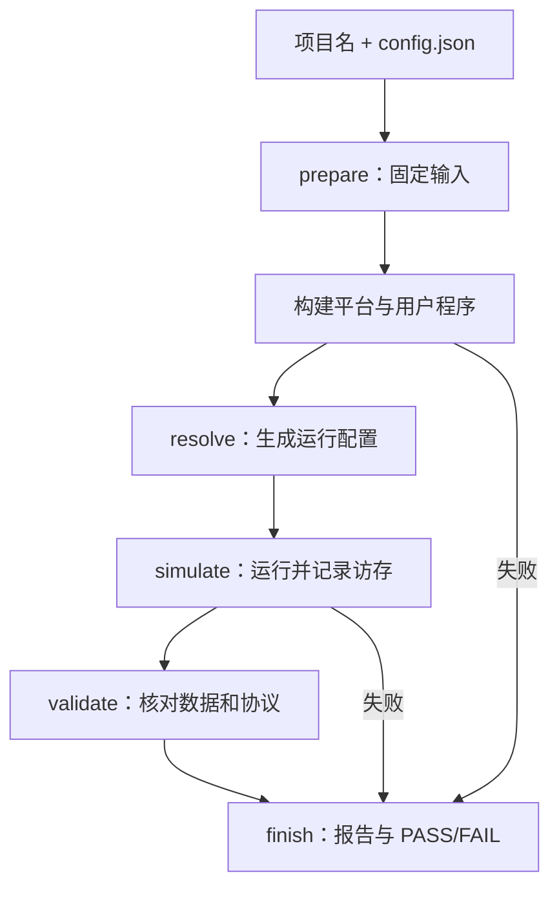

# run.sh：解释版

对应原文件：[vortex_StorageStacked/user/run.sh](https://github.com/hy2581/vortex_StorageStacked/blob/2014e742e88dcd2d8209c4ddb86c0d6c2d0ce5c2/user/run.sh)。本文件以原文件名加 `.md` 命名，内容为 Markdown 阅读说明。

用户项目的统一运行入口，串联编译、仿真和结果校验。

## 用户输入

在原项目的 `user/` 下使用：

```bash
./run.sh smoke
./run.sh llm
./run.sh smoke --config config.json --output result/check
./run.sh llm --test
```

第一个参数是 `user/` 下的项目目录名，脚本检查该项目是否具有 `src/Makefile`。
`--config` 和 `--output` 都相对于选中的项目目录，而非当前 shell 目录。
默认配置是 `config.json`，默认输出为带时间戳的新 `result/` 子目录。
已存在的运行目录不会被默默覆盖；再次使用自定义名称时应换一个新名称。

## 按执行顺序读脚本

| 位置或阶段 | 作用 |
| --- | --- |
| 参数解析 | 读取项目名、配置和输出选项，拒绝多个项目名、非法名称和未知选项。 |
| 环境准备 | 切换至仓库根目录，加载 `third_party/gem5/runtime/environment.sh`，确定内部 Python 和工具。 |
| prepare | 校验相对路径和配置，创建新的结果目录，保存 input.json，固定本次输入。 |
| 编译 | 先检查平台是否就绪；需要构建时持有独占锁，否则使用共享锁，然后调用项目 Makefile。 |
| resolve | 解析配置与编译产物，记录 resolved.json、environment.json 和运行器路径。 |
| simulate | 在结果目录启动 gem5.opt 和 integration/system.py，CPU 执行 host.elf，GPU 执行 program.vxbin。 |
| validate | 校验计算返回值、模型数据和 AXI/UCIe/MEMSIM 链路，生成 summary.json 与 report.md。 |
| finish | EXIT trap 汇总当前阶段和退出码；只有整体验证通过才打印 PASS，否则写入失败状态。 |

## 锁、错误和测试入口

构建锁防止运行期间的平台文件被另一个构建替换。构建需要独占访问，仿真阶段使用共享锁。
`stage` 依次为 build、simulate、validate，出错时保留失败阶段和已经产生的日志。
INT/TERM 信号分别转换为退出码 130/143，再进入统一收尾流程。

`--test` 转入内部回归入口，它使用内置回归配置，不能与自定义配置或输出路径一起使用。
添加新项目时，入口通过目录、JSON 和 Makefile 识别它；若引入新的负载类型，还需要让内部配置与校验逻辑支持其约定。

## 主要输出

本次运行的所有主要文件保存在 `user/项目/result/运行目录/`：
`build.log` 记录编译，`run.log` 记录仿真，`validation.log` 记录校验。
`completion.json` 表示计算是否正常结束；`summary.json` 和 `report.md` 表示完整校验结果。
更详细的文件分类见 [SMOKE 输出](smoke/result/README.md) 与 [LLM 输出](llm/result/README.md)。



## 按一条真实命令展开路径

假设在原项目 `user/` 执行：

```bash
./run.sh smoke --config slow.json --output result/slow-01
```

脚本选择 `user/smoke`；prepare 读取 `user/smoke/slow.json`，
创建 `user/smoke/result/slow-01`，保存本次 `input.json`。
进入 `src/` 编译时，它传入的 CONFIG 是 `../result/slow-01/input.json`，
OUT 是 `../result/slow-01/build`。两者都以 `src/` 为起点。

`--config` 不能写绝对路径，也不能用 `../` 越出任务目录。
如果配置不合法，可能在创建结果目录之前就退出，此时应先看终端报错。

## 几行 Bash 是怎样工作的

| 写法 | 作用 |
|---|---|
| `"$@"` | 原样转发传给脚本的多个参数，保留参数边界 |
| `source ...environment.sh` | 把工具环境加载到当前脚本 |
| `exec 9>...build.lock` | 打开一个文件，供后续 flock 协调构建与运行 |
| `flock -x 9 / -s 9` | 独占锁 / 共享锁；避免运行时平台被替换 |
| `>日志 2>&1` | 把普通输出和报错都写入该日志 |
| `trap finish EXIT` | 离开脚本时统一整理结果与退出码 |

等待构建锁时，终端可能暂时没有新输出。先确认是否有另一项构建或仿真占用平台。
当前命令无 --input 事务选项；它执行的是 C++ 用户任务。

## 失败阶段与下一步

- `build`：读 build.log，先修编译或平台就绪问题。
- `simulate`：读 run.log 和 completion，判断加载、设备运行还是超时。
- `validate`：读 validation.log/verification.log，寻找数据、协议或波形的第一处失败。

finish 不能把尚未形成通过 summary 的运行标成 PASS。
即使设备自己宣布完成，脚本仍会等独立校验给出最终结论。
