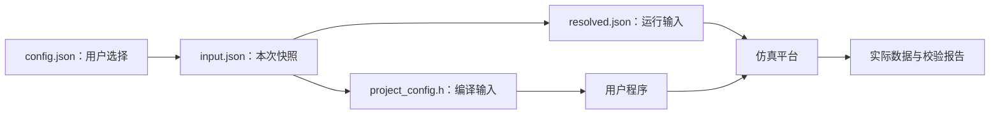

# config.json：这次运行选什么参数

对应原文件：[vortex_StorageStacked/user/smoke/config.json](https://github.com/hy2581/vortex_StorageStacked/blob/2014e742e88dcd2d8209c4ddb86c0d6c2d0ce5c2/user/smoke/config.json)。

在这里设置加一程序的输入值，以及设备和存储的运行参数。

## 输入与输出

输入是用户填写的 JSON 参数。`run.sh` 保存本次配置为 `result/运行目录/input.json`，
编译阶段据此生成 `project_config.h`，解析阶段生成 `resolved.json`。
仿真器读取解析后的结构，校验器读取这次运行保存的配置和存储实际返回的数据。

保存这个文件只是在磁盘上保存配置；只有随后执行编译好的程序，才会发生模拟内存读写。

## 这里能改哪些参数

| 字段 | 当前值 | 含义 |
| --- | --- | --- |
| `program.type` | `"smoke"` | 任务类型；用于生成编译配置和选择结果校验器。程序源码由 Makefile 指定。 |
| `program.input` | `41` | SMOKE 的 uint32 输入；期望结果为输入加 1，按 32 位无符号数回绕。 |
| `program.workers` | `4` | SMOKE 发射的 GPU 工作组数量；每组处理一个输入元素，每组一个线程。 |
| `gpu.clock_mhz` | `1000` | Vortex 设备时钟频率，单位 MHz。 |
| `gpu.cores` | `2` | Vortex GPU core 数量，与 host.num_cpus 独立。 |
| `gpu.warps` | `4` | 每个 GPU core 可配置的 warp 数量。 |
| `gpu.threads` | `4` | 每个 warp 的线程上下文数量；不是 GEM5 CPU 线程数量。 |
| `gpu.l1i_bytes` | `16384` | Vortex 一级指令缓存容量，单位字节。 |
| `gpu.l1d_bytes` | `16384` | Vortex 一级数据缓存容量，单位字节。 |
| `gpu.l2_enabled` | `false` | 是否启用 Vortex 二级缓存；与 host.l2 独立。 |
| `gpu.l2_bytes` | `1048576` | Vortex 二级缓存容量，单位字节；启用 L2 时生效。 |
| `host.clock_mhz` | `2000` | GEM5 CPU 时钟频率，单位 MHz。 |
| `host.num_cpus` | `4` | GEM5 CPU 核数量，也用于生成示例主机程序的 HOST_CPU_COUNT。 |
| `host.l1i` | `"32KiB"` | GEM5 CPU 一级指令缓存容量，使用带单位字符串。 |
| `host.l1d` | `"32KiB"` | GEM5 CPU 一级数据缓存容量，使用带单位字符串。 |
| `host.l2` | `"1MiB"` | GEM5 CPU 侧二级缓存容量，使用带单位字符串。 |
| `host.tlb_entries` | `64` | CPU 地址转换缓存 TLB 的条目数。 |
| `axi.period_ns` | `2` | AXI 时钟周期，单位 ns；2 ns 对应 500 MHz。 |
| `axi.outstanding` | `16` | 桥接器允许同时在途的请求数；不是 GPU 线程数。 |
| `axi.planes` | `2` | AoU 链路资源 plane 数量；不是 LLM 内存区域数或 MEMSIM 通道数。 |
| `axi.stalls` | `true` | 启用可重复的等待/背压，检查 AXI 握手和通道独立性。 |
| `axi.replay` | `false` | 开启后注入可重复的物理 flit 错误，运行链路重传检查。 |
| `ucie.lanes` | `16` | UCIe lane 数量；属于链路构建参数。 |
| `ucie.rate_gtps` | `24` | 每条 lane 的符号速率，单位 GT/s。 |
| `ucie.bits_per_symbol` | `1` | 每个符号承载的位数；与 lane 数和速率共同决定带宽。 |
| `ucie.tat_ns` | `40` | 链路周转时延参数，单位 ns。 |
| `memsim.standard` | `"hbm4"` | 存储协议模型，可选 hbm3、hbm4、lpddr5、lpddr6。 |
| `memsim.channels` | `8` | 存储模型的通道数；与 CPU/GPU 核数独立。 |
| `memsim.scale` | `1` | 存储模型原生时钟周期的倍率；数值增大表示存储时钟变慢。 |
| `memsim.queue` | `4` | 存储入口、控制器与返回队列使用的容量参数。 |
| `memsim.slots` | `8` | 存储后端允许在途的 AXI burst 数量。 |
| `memsim.response_hold` | `0` | 额外保持存储响应的时长，单位为存储时钟 tick，用于压力测试。 |
| `simulation.max_ticks` | `20000000000000` | 仿真超时上限，单位 fs；当前值相当于 20 ms 仿真时间。 |

## 修改后怎样生效

1. 在原项目中修改本文件并保存。
2. 在原项目的 `user/` 下执行 `./run.sh smoke`。
3. 查看新的 `result/运行目录/input.json` 和 `resolved.json`，确认本次选用了哪些参数。
4. 查看 `summary.json`、`report.md` 与实际波形、返回数据，确认执行结果。

`program` 参数进入生成头文件；设备、AXI 和存储参数进入平台配置。
UCIe 参数还影响平台编译，运行入口负责选择或构建匹配的平台。
JSON 未提供通用地址布局字段，当前数据区地址由示例源码定义。

## CPU、GPU 与工作组怎样对应

当前配置为 4 个 GEM5 CPU 核、2 个 Vortex core，每个 GPU core 配置 4 个 warp、每个 warp 4 个线程上下文。
两套核数分别控制 CPU 与 GPU，不能互相替代。

SMOKE 的 `program.workers=4` 表示 4 个 GPU 工作组；LLM 没有该字段，SDK 为它设置 1 个工作组。
两个示例的 `host.cpp` 都创建 `HOST_CPU_COUNT` 个 CPU 工作线程，承担输入准备和返回检查。
核数、可容纳的线程数和一次负载真正发射的线程数是三个不同数值。

## 第一次修改，先改哪一项

SMOKE 先改 `program.input`：41 改为 100，预期输出随之由 42 改为 101。先保留时钟、链路和内存设置。

建议复制当前完整配置为 `experiment.json`，放在同一个任务目录。
在原项目 `user/` 执行 `./run.sh smoke --config experiment.json`，
随后对照新结果目录的 `input.json`，确认这次确实使用了副本。

## 这些参数分别控制什么

| 一组参数 | 控制的事情 | 改后怎样核对 |
|---|---|---|
| `program` | 本次做什么、输入是什么 | 生成配置、实际数值与任务摘要 |
| `host/gpu` | 计算平台的时钟和结构 | 本次 resolved 与平台配置、运行统计 |
| `axi` | 桥接容量、时钟和握手等待 | 实际 AXI 波形与 protocol_summary |
| `ucie` | 链路宽度、速率和周转预算 | ucie_config.json 中实际编译值 |
| `memsim` | 内存标准、队列、通道和时间步长 | memsim_config.json |
| `simulation` | 模型最多推进多长时间 | completion 和是否超时 |

## 哪些设置会被拒绝

- 时钟频率为 1～10000 MHz 的整数，并且周期必须能用整数 fs 表示。
- AXI 周期为 1～1000 ns 的整数，在途容量为 1～128，planes 为 1～4。
- 内存 channels/scale/queue 为 1～1024，slots 为 1～1023；底层模型还会检查具体组合。
- LLM 生成数为 1～8，prompt 非空，输入长度加生成数减一不超过 16。
- GPU cores/warps/threads 必须是 1、2、4、8、16、32 之一。
- GPU 缓存字节数为 4096～16777216 的 2 的幂；CPU 数为 2～64。
- SMOKE workers 为 1～256；它是任务组数，与硬件核心数分别设置。

两个计算项目对配置要求完整，不能只保存改过的两三个字段。
`program.type` 必须与源程序使用的宏和检查约定匹配。
例如 smoke 用 `SMOKE_INPUT`，custom 的 `defines.INPUT` 生成的是 `APP_INPUT`。

更完整的字段限制由 [当前 configure.py](https://github.com/hy2581/vortex_StorageStacked/blob/2014e742e88dcd2d8209c4ddb86c0d6c2d0ce5c2/third_party/gem5/runtime/configure.py) 检查。
prompt 的词表检查还在模型编译步骤中进行，不能只通过 JSON 语法就算输入可运行。
