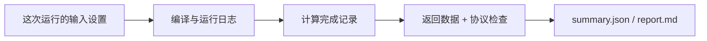

# SMOKE：运行后到哪里看结果

这页告诉你一次运行后该打开哪些文件。日志和波形保存在原项目的运行目录中。
原项目运行时创建 `result/运行目录/`；以下文件名均相对于其中一次运行目录。
执行根目录 `build.sh` 时，还会生成 `result/build/`；运行测试时可能再按测试名创建子目录。
文件是否存在取决于已完成的阶段；失败或较早格式的运行可能只有其中一部分。

## 先看这几个文件

1. 打开 report.md 看运行结论和输出位置。
2. 检查 summary.json 的完整状态，再看 completion.json 的设备退出原因。
3. 查看 smoke_summary.json 的实际输入、输出与期望比较。
4. 需要追踪访存时，从 transactions.csv 查看地址，再关联 AXI、UCIe 与 MEMSIM 记录。

即使程序退出码是 0，或 `completion.json` 显示设备已结束，也要等 `summary.json` 的完整检查结果。

## 每次运行常见的文件

| 文件或目录 | 看什么 |
| --- | --- |
| `smoke_summary.json` | 加一程序的输入、实际输出和检查结果。 |
| `input.json` | 运行时保存的输入配置；先看它，确认自己没有打开旧结果。 |
| `resolved.json` | 运行所需的 architecture、程序路径、模型信息等解析结果。 |
| `environment.json` | 本次运行使用的环境与工具信息。 |
| `build/` | 用户程序、生成头文件及运行器选择记录；具体文件由平台编译流程决定。 |
| `build.log` | 平台检查、用户编译及解析阶段日志；编译失败先看这里。 |
| `run.log` | 设备/主机程序输出、仿真器信息和异常；运行失败先看这里。 |
| `validation.log`、`verification.log` | 结果与链路校验过程日志；数值或协议失败时查看。 |
| `completion.json` | 设备何时结束、为什么结束；这还不是整次运行的最终结论。 |
| `summary.json`、`report.md` | `summary.json` 给出最终检查状态，`report.md` 方便人阅读。 |
| `config.json`、`ucie_config.json`、`memsim_config.json` | 仿真器、编译链路、存储模型的实际配置记录；与`input.json` 对照，确认参数实际用了什么。 |
| `transactions.csv` | 每笔请求的地址、长度、拆分段数，以及从接收到把结果交回程序的时间。 |
| `axi_events.csv`、`axi256_handshakes.csv` | AW、W、B、AR、R 五类信号的记录；可查看请求何时被接收、结果何时返回。 |
| `axi_first_200ns_cycles.csv`、`axi_flit_path.csv` | 前段周期视图、AXI 到 flit 路径的关联记录。 |
| `axi_wave.vcd`、`axi_view.gtkw`、`axi_overview.svg` | 信号波形、GTKWave 查看配置和总览图。 |
| `ucie_flits.csv`、`ucie_soc.csv`、`ucie_mem.csv`、`flit_pairs.csv` | UCIe 上传送的小包（flit），以及两端发送和接收的对应记录。 |
| `aou_events.csv`、`aou_messages.csv`、`aou_summary.json` | AXI over UCIe 消息、事件与汇总。 |
| `aou_check_summary.json`、`link_check_summary.json`、`check_summary.json`、`protocol_summary.json` | 各项检查的结果；整次运行是否通过，仍要看最终的 `summary.json`。 |
| `memsim_bridge.csv`、`memsim_bridge_summary.json`、`memsim_check.json` | 公共后端与存储模型之间的请求/响应及检查。 |
| `memsim_commands.csv`、`memsim_core.json`、`memsim_stats.txt` | 存储命令、核心配置/状态与统计。 |
| `memsim_dfi.csv`、`memsim_dfi_signals.csv`、`memsim_image.csv`、`memsim_journeys.json` | DFI 交互、实际内存镜像与请求轨迹，用于追踪数据去向。 |
| `memsim_view.html`、`memsim_data/` | 存储过程的可视化页面与配套数据。 |
| `trace_view.html`、`trace_flits_data/`、`trace_paths_data/`、`view_store.js` | 链路浏览页面和分片数据；阅读时需要保留配套目录。 |
| `wave_audit/` | 波形审计的中间结果与检查记录。 |

## GEM5 + Vortex 的补充文件

| 文件或目录 | 看什么 |
| --- | --- |
| `build/host.elf` | GEM5 x86 CPU 执行的主机程序。 |
| `build/program.elf`、`build/program.vxbin` | RV32 ELF 与 Vortex 加载镜像。 |
| `build/programs.json`、`build/sources/`、`build/readback.json` | CPU/GPU 程序及源文件对应关系、本次编译保存的源码副本和实际读回的地址范围。 |
| `build/simulator.path`、`build/system.path` | 本次 GEM5 程序和 system.py 入口位置。 |
| `host_summary.json`、`soc_summary.json` | CPU 多线程工作、核活动和 SoC 配置/运行汇总。 |
| `mmu_translations.csv` | 地址转换观测记录。 |
| `stats.txt`、`hettrace/` | GEM5 统计及主机/设备访存追踪。 |
| `config.ini`、`config.dot` 及其图形文件、`citations.bib` | GEM5 自动导出的对象配置、连接图和引用信息。 |

## 这次运行重点看什么

当前默认输入为 41，期望加一结果为 42。
CoralNPU 示例由设备写入并读回一个输入字；Vortex 示例由 CPU 上传输入数组，再由 GPU 各组加一、CPU 检查整个数组。
实际地址、访问大小和传输数量以本次原生/TLM 与 AXI 记录为准，不直接用源码指针的元素大小代替总线传输大小。



## 打开自己这次的结果

假设刚从原项目 user 目录运行：

```bash
./run.sh smoke --output result/reading-01
cat smoke/result/reading-01/input.json
cat smoke/result/reading-01/report.md
cat smoke/result/reading-01/summary.json
```

先看 `input.json`，确认这次实际用了哪些设置。`report.md` 适合阅读，
summary 给出最终结论。运行失败时，文件可能尚未生成齐，先看失败阶段再决定打开哪个日志。

## 读数字时先看三件事

1. **字段在哪个文件？** 同名 passed 在 completion 与 summary 中覆盖的范围不同。
2. **单位是什么？** tick_fs 是 fs，周期数要配合该设备的频率。
3. **数的是哪种请求？** 程序提出的一笔读写，可能拆成多个 AXI burst，再变成多个 UCIe flit 和内存请求。

SMOKE 先对照实际输入与输出：默认 41→42。
CoralNPU 的核心数据访问是四笔；Vortex 还涉及主机上传、GPU 执行和回读，
其请求数量不能直接套用 NPU 的四笔。

## 怎样追查一笔读写

Vortex 从 transactions.csv 的地址、ID、开始/完成时间和 segments 开始。
一笔 TLM 请求可能有多个 AXI burst；用各笔 segments 的总和对照 AXI 地址握手数。

再去 axi_events.csv 找对应地址通道与 R/B 返回，
需要看停顿时，打开同一时间区间的 axi_wave.vcd。
用 UCIe 与 mem_sim 的关联记录继续向后追，不要仅用两份 CSV 的行号相等来配对。

请求 ID 可能在完成后再次使用。追查时要同时看读写方向、发生时间和原请求序号。
数据以字节串、十进制整条总线值或浮点数显示时，先统一地址与字节顺序再比较。

## 文件不全时先查哪里

| 最后完成的阶段 | 可能已有 | 下一步 |
|---|---|---|
| 本次保存的配置 | input.json、初始报告 | 看终端和 build.log |
| 编译 | build 中的程序 | 看运行阶段是否启动、run.log 是否报错 |
| 设备结束 | completion 和原始日志 | 等待或排查独立校验 |
| 完整校验 | summary、任务摘要与报告 | 检查最终 passed 及各项检查 |

可视化网页依赖同目录下的数据分片和 JS；复制分享时保留它们的相对位置。
结果里出现的历史计数、延迟属于那一份配置和程序，不能直接套到另一份实验。

本页是结果读法，不是本轮新仿真的通过报告。
