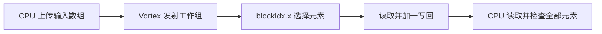

# kernel.cpp：GPU 怎样把输入加一

对应原文件：[vortex_StorageStacked/user/smoke/src/kernel.cpp](https://github.com/hy2581/vortex_StorageStacked/blob/2014e742e88dcd2d8209c4ddb86c0d6c2d0ce5c2/user/smoke/src/kernel.cpp)。

这段 GPU 程序让每个工作组读取一个数、加一，再把结果写回。

## 输入与输出

输入由 GEM5 上的 host.cpp 上传到 GPU 地址 `0x90000000`。
输出数组位于 `0x90010000`，状态字位于 `0x9005000c`。
设备代码编译为 RV32 的 program.elf 和 program.vxbin，再由主机程序加载和发射。

## kernel_main 按顺序做什么

1. 读取 `blockIdx.x` 作为当前工作组的元素下标。
2. 读取 input[index]，加一后写入 output[index]。
3. 读回 output[index]，确认写入结果。
4. 仅下标 0 的工作组写状态字：成功 `0x600d0000`，失败 `0xbad00001`。

所有工作组的输出都由 host.cpp 后续逐个检查，不能仅凭第 0 组的状态判断整个数组正确。
uint32 加法会按 32 位回绕；volatile 保留编译后的内存访问，但访问仍可能命中 GPU 缓存。

## 工作组与硬件核的关系

host.cpp 使用 APP_WORKGROUPS 发射工作组，SMOKE 当前由 program.workers=4 生成这一值，且每组一个线程。
工作组的调度由 Vortex 完成；4 个工作组与当前配置的 2 个 GPU core、4 个 GEM5 CPU 核没有一一对应关系。

修改负载并行份数看 config.json 的 program.workers；修改设备硬件规模看 gpu.cores/warps/threads。

## 看第 2 个下标怎样处理

当前四个工作组编号为 0、1、2、3。取 `index=2`：

| 操作 | 地址或数值 |
|---|---|
| `input[index]` | `0x90000000 + 2×4 = 0x90000008` |
| 读回 value | 默认 41 |
| `output[index] = value + 1u` | 向 `0x90010008` 写入 42 |
| 再读 output[index] | 默认 observed 为 42 |
| `if (index == 0)` | 当前下标为 2，不写总状态字 |

`blockIdx.x` 是本次任务中的组编号。CPU 发射 4 个组，每组一个线程，
并不要求四组同时驻留在四个硬件核上；平台负责调度它们。

## 代码里的地址与返回检查

`reinterpret_cast<volatile uint32_t *>` 把数字地址解释成指向 4 字节整数的指针。
`input[index]` 每增加一个下标，地址增加 4。`volatile` 保留读写，但仍受 GPU 缓存影响。

只让第 0 组写状态，避免各组同时争写同一个标志。
CPU 在等待整个 GPU 任务结束后，会逐个检查所有组的输入与输出，
所以第 0 组的成功标志不替代整数组检查。

想试输入 100，只改 JSON 后重新运行。
想把加一改成加二，则要同步修改 host 的期望和任务检查约定，不能继续套用固定 SMOKE 检查。
